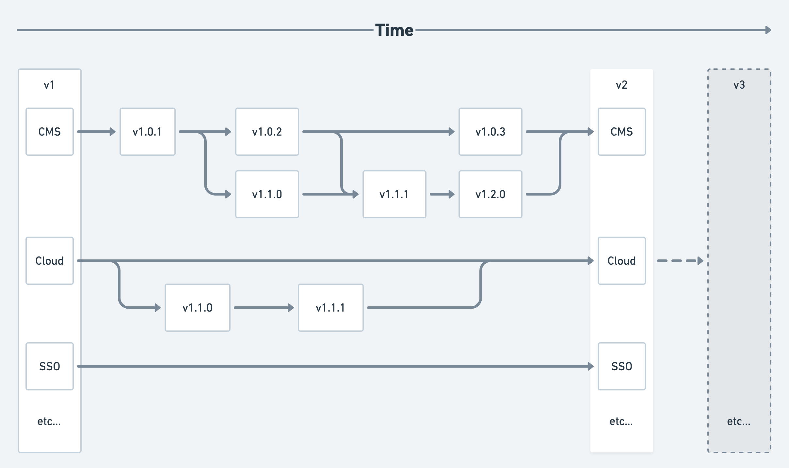

# Altis Releases

Altis has one major version for the entire platform, and each module underneath it also has a major version and a bugfix version. The full version number for all modules follows the following scheme:

```
<platform major>.<module major>.<bugfix>
```

Every Altis major release synchronises all versions. For example, Altis version 42 would contain CMS version 42.0.0, Cloud 42.0.0, etc upon release.

The `<platform major>.0` version is treated as the [long-term support](./long-term-support.md) version.




## Bugfix Releases

Each module releases bugfixes separately when necessary. You should ensure you are always running the latest bugfix version of each module by periodically running `composer update` and committing the updated `composer.lock` file.

These bugfix versions are generally not synchronised. Bugs occurring across multiple modules may trigger bugfix releases for each module.

For example, the latest versions for Altis version 42 may include CMS version 42.0.6, Cloud 42.0.2 and Media 42.0.0.


## Module Releases

Modules may preview new features periodically, and outside of the Altis major version. These new features are stable and production-ready, but may be incomplete, so we treat them as preview releases. Once they are feature-complete, they will be included in the next Altis major release.

These preview releases always have a `<module major>` component larger than `0`.

For example: with latest version of Altis at version 42, the CMS module may preview a new feature. We will release 42.1.0 with this new feature, and those who want to use it could opt-in to using 42.1.0, while keeping the other modules at 42.0.0

Only the latest module major release and the `0` release are supported. For example, if the CMS module has releases at 42.0.0, 42.1.0, 42.2.0, and 42.3.0, only the 42.0.0 and 42.3.0 release lines would be supported.

[Learn how to opt in to module preview releases here](./module-preview-releases.md)
