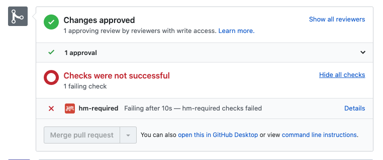
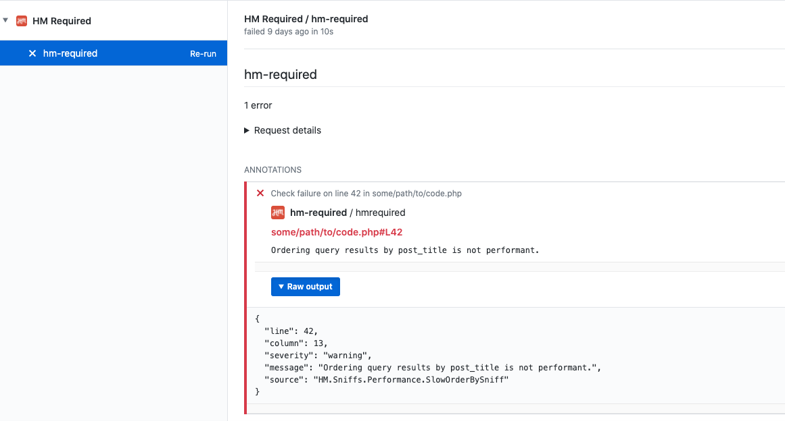
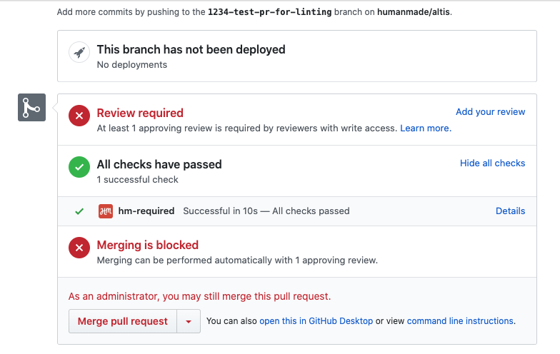
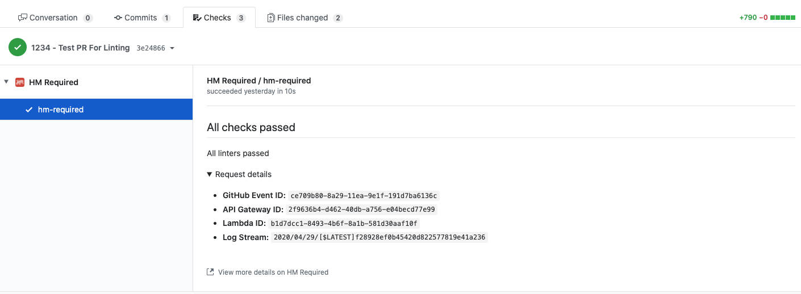
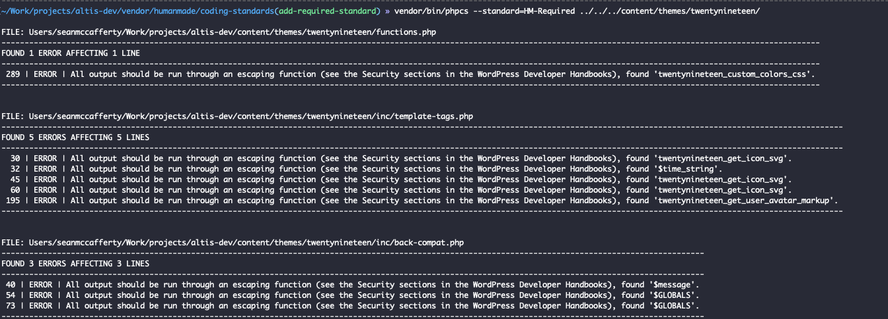

# Code Review

All Code Review for Altis is done via GitHub in the pre set-up GitHub repository for your project. Specific development flow process varies project to project, this document only covers the required Human Made Code Review. Specifically where in the "code development to running in production" flow the Human Made Code Review needs to be performed can be discussed separately.

It is required that all code review be performed on Git branches, via a GitHub Pull Request. When a given Git branch is ready for review, the following process should be followed:

1. Open a Pull Request against the "mainline" branch (typically `master` or `staging`)
1. Make sure your Pull Request passes any status checks and WordPress Coding Standards.

Once the Pull Request is submitted, an automated code review will be performed. In this case, the Pull Request will be marked as "Changes Requested" and you should fix up any errors to do with formatting for the manual review to continue.

## Manual Code Review
Upon receiving a new Pull Request, Human Made may also perform a manual code review. This will result in one of three outcomes:

1. "Changes Requested" - We asked for some things to be changed in the code, they should be rectified before a second review pass.
1. "Commented" - We asked a question of for more information for the Pull Request. Get back to us, and we'll be able to continue.
1. "Approved" - The code is ready to be merged into the mainline branch, and will not need to be reviewed again on it's way to production!

Once a Pull Request is reviewed, the next steps depend on the process of the project. You may communicate on the Pull Request for Human Made to merge and deploy the Pull Request on Approval. This can be done via a comment, or a label of "Review Merge" or similar.

The Pull Request will be assigned back to the developer, if the Pull Request requires changes or comment. Once the changes have been made, the developer should assign the Pull Request back to the `@humanmade-cloud` GitHub user.

If you only want code reviewed, but not yet merged and deployed then you don't need to do anything. This is useful if you want to control when code is merged to the mainline branch, as you can perform the merge yourself.

Note: If you have requested Code Reviews from other users, we will not merge and deploy a Pull Request until those users have also Approved the Pull Request.

## Automated Code Review
Automated Code Review (commonly referred to as ACR) is used to check a code base for errors to ensure a website and overall stack’s security and performance is not compromised. This tool is used to perform a preliminary check for potential problem areas and ensure a better consistency of the standards we apply to the code we review rather than being dependent on the reviewer. 

### When is it performed?
The ACR process is similar to the current process and is kicked off when a Pull Request (PR) is created. Every commit pushed to a branch after the PR is created will have the ACR process executed against it.

### How will I know if there are issues with my code?
Errors are highlighted within GitHub, under the review section.



Details:



If no errors are found:



Details:



### What types of code are checked?
The types of code that are reviewed are JavaScript (unbuilt) and PHP. CSS files can also be reviewed but are not at this point.

### What is looked for?
The ACR focus on security and performance issues. At a high level, the following are checked:
- SQL Injection
- XSS and XSRF attacks
- Escaping Output and Sanitising Input
- Composer and NPM Dependency vulnerabilities
- Meta Value queries, Database related queries, Disk Access, Object Caching, WP_Query Specifics, Differently named cookies 

For a more detailed breakdown of the automated code review standards visit [Standards](./standards.md).

### What are the benefits to ACR?
Allows for initial and immediate checks to a code base for errors to ensure a website’s security and performance is not compromised before the code is deployed to the Cloud. A basis of standards are set so code review is consistent when involving internal and external reviewers.

### Can I run this process locally?
To do so ensure you have the [humanmade/coding-standards](https://github.com/humanmade/coding-standards) cloned into your repo using composer `composer require --dev humanmade/coding-standards`.

An Altis command is still in development, however, since the ACR is based on a custom PHPCS standard the process executed locally by running the following command `vendor/bin/phpcs -e --standard=HM-Required`.



### Is there a way I can have the ACR ignored?
Lines of code can be ignored however entire files and folders can not.

Example
```php
<?php

// phpcs:ignore HM.Security.EscapeOutput.OutputNotEscaped -- Performing an example so we need to ignore the following line.
$test = 'Hello World';
```

### What if an issue found in ACR is a false positive?
A false positive can be ignored using the method in [Is there a way I can have the ACR ignored?](#is-there-a-way-I-can-have-the-acr-ignored?). In addition to ignoring the specific sniff that was causing an issue within PHPCS you should also include a note next to the sniff, giving a brief explanation why the sniff was ignored.
