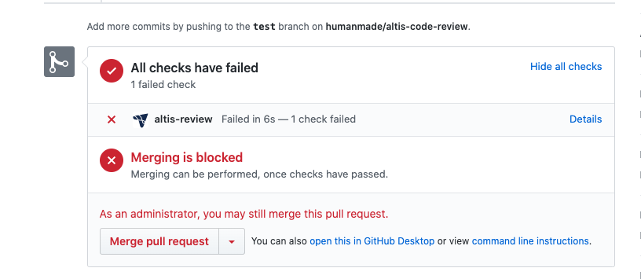
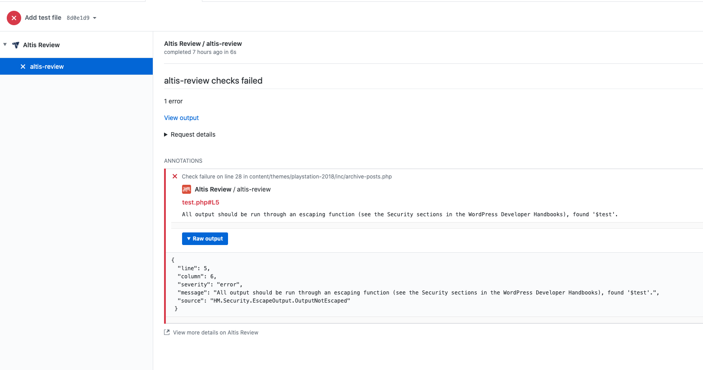
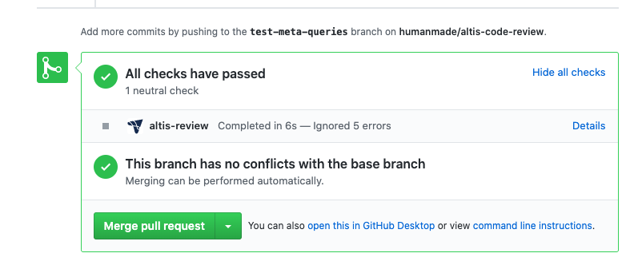

# Code Review

All Code Review for Altis is done via GitHub in the pre set-up GitHub repository for your project. Specific development flow process varies project to project, this document only covers the required Human Made Code Review.

It is required that all code review be performed on Git branches, via a GitHub Pull Request. When a given Git branch is ready for review, the following process should be followed:

1. Open a Pull Request against the "mainline" branch (typically `main`, `development` or `staging`)
1. Make sure your Pull Request passes all status checks

Once the Pull Request is submitted, an automated code review will be performed. In this case, the Pull Request will be marked as "Changes Requested" and you should fix up any errors that are highlighted.

## How will I know if there are issues with my code?

Errors are highlighted within GitHub, under the review section.



Details:



If no errors are found:




## What types of code are checked?

The types of code that are reviewed are JavaScript and PHP. CSS files can also be reviewed but are not at this point.

Note that [JavaScript code should not be minified](./minified-code.md), and instead should be built via the [build process](docs://cloud/build-scripts.md).

## What is looked for?

Code review focuses on security, performance, and stability by testing for common vulnerabilities and problems, such as the OWASP Top Ten.

This includes, but is not limited to:

- SQL Injection
- XSS and XSRF attacks
- Escaping output and sanitizing input
- Dependency vulnerabilities

The [coding standards documentation](./standards.md) contains much more detail about the specific rules your code must pass.

## What should I do if errors are found?

Before a pull request can be merged, the altis-review check must pass.

In general, the errors should be addressed, using the provided details in order to resolve the issue. The Altis Cloud team is happy to provide guidance on how to solve specific errors, or potential changes to your architecture to avoid these.

In rare cases, the error may be a false positive or a result where the check does not possess the required logic to adequately evaluate the part of code. If you are certain this is the case (such as for false positives), the error may be ignored, using the method below.


## Is there a way I can have lines ignored? {#ignore}

Lines of code can be ignored however entire files and folders can not. A comment is also required so that future reviewers understand why the part of code is ignored from ACR/

Example
```php
<?php

$test = 'Hello World';
// phpcs:ignore HM.Security.EscapeOutput.OutputNotEscaped -- Performing an example so we need to ignore the following line.
echo $test;
```

**Note:** When adding or changing these ignore comments, manual review of the codebase by the Altis Cloud team will be required per the Manual Code Review section.


## Can I run this process locally? {#local}

To do so ensure you have the [humanmade/coding-standards](https://github.com/humanmade/coding-standards) cloned into your repo using composer `composer require --dev humanmade/coding-standards`.

An Altis command is still in development, however, since the ACR is based on a custom PHPCS standard the process can be executed locally by running the following command `vendor/bin/phpcs -p --standard=HM-Minimum .`.
