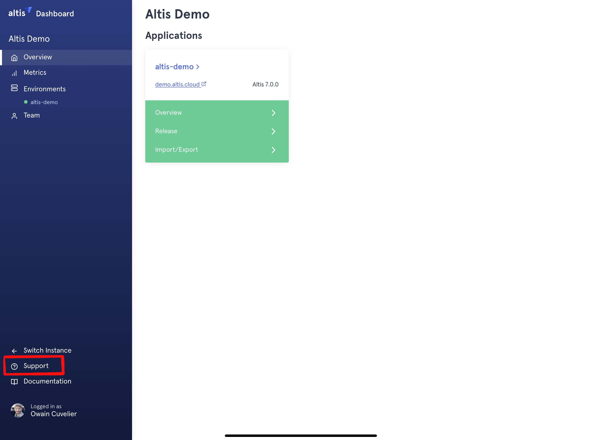
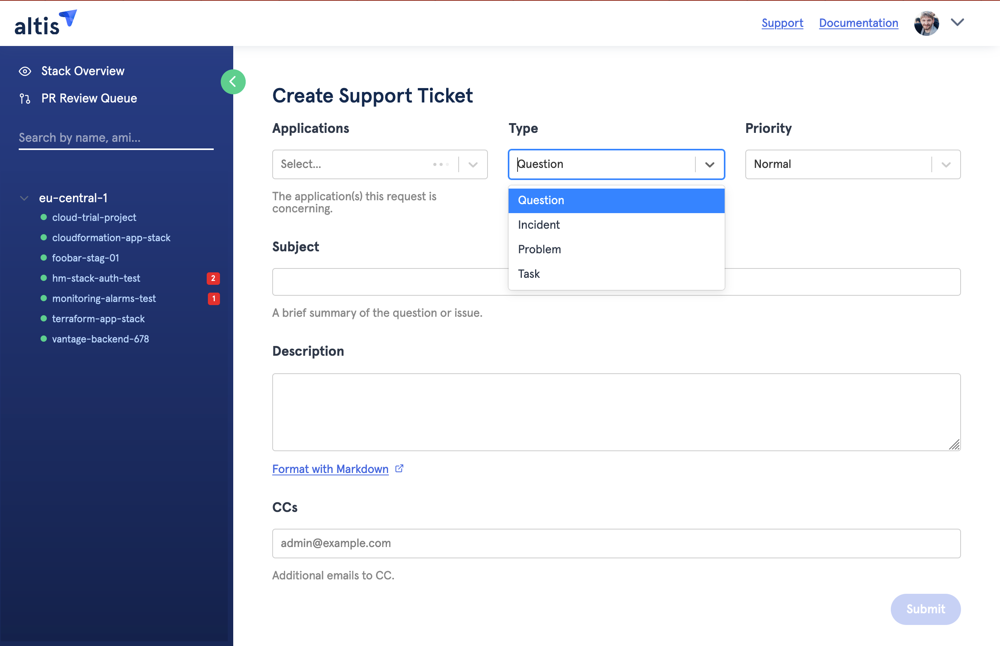

# Getting help with Altis

Everybody needs a little help sometimes, and in this guide we'll inform you on how to open support requests from the Altis Support Team. 

## Altis Dashboard

Support happens via the Altis Dashboard. From your Altis Dashboard you will be able create, view, and reply to open support requests. 

To open a support request, first you'll have to [login to the Altis Dashboard](dashboard.altis-dxp.com/).

From there, you'll find the link to the support page in the top right corner. See below.

From this screen you'll be able to view your open issues, all previous issues, and you can also query open and previous issues if you're looking for something specific. 

To open a new support ticket, simply click the blue 'Create New Ticket' button.

## Create Support Ticket

A quick overview of the of the screen: 

**Application**

Select the specific Application or select all Application(s)/Environment(s) to which the support ticket concerns.

**Type**

The type of support ticket, of which there are currently 4. Question, Incident, Problem, and Task. We'll go into more detail about which these categories below, but most tickets will generally fall into one of these four. 

**Priority**

You can change the priority of a support issue if you need to. In most cases you shouldn't need to change this, but feel free to let us know if something is a priority.

**Subject**

Short line describing the support request.

**Description**

The body of the support request.

**CCs**

You can CC additional relevant parties to the support request if desired. They will recieve carbon copies of the correspondance.

## Support Ticket Types

We break down support into different categories. Each has its own language and processes, but it should be somewhat intuitive. Let's go over the types.

We currently have four types of support. Below is a description of each and how they are different from each other.

### Incident

Incidents are unplanned events that negatively impact service, or quality of service of Altis. Be this part of the hosting infrastructure, or on the software side of Altis, if there is an issue which is causing an immediate business impact, this would be an Incident, and you can make a support request to help investigate.

From the support team side, Incidents get a rapid response. Alarm bells will ring, and we’ll put out the fires to get things running again by any means necessary.

If the site is down for example, select the 'Incident' type, with a priority of ‘Urgent’.

### Problem

Problems are the cause of, or can be the potential cause of future Incidents. If you're encountering a problem which could cause potential Incidents, let us know!

### Task 

There’s an array of tasks that might you need help with. Typically, this might mean provisioning of infrastructure to accommodate some need, it might be providing access to some tool or service used by the team, or it could be to run an operation that requires a cloud engineer. 

Tasks should be well described with detailed requirements and time scales. We will not be able to service same-day requests.

### Question

Have a question for us? Ask!

If you have a technical question or require clarification on a feature, just open a support question, and our support team will get back to you.

## Email

The second method for creating a support ticket is email. This is offered as a backup option should you be unable to open tickets via the Altis Dashboard.

The following email addresses can be used to create different types of ticket as indicated:

- **support@altis-dxp.com** 
   This will create a new support ticket for the support team.
- **hosting@altis-dxp.com** 
   This will create an Incident type ticket (non-urgent).
- **sysops@altis-dxp.com** 
   This will create an ‘Urgent’ Incident type ticket, and is linked to PagerDuty. This will alert on-call engineers to the emergency. 
