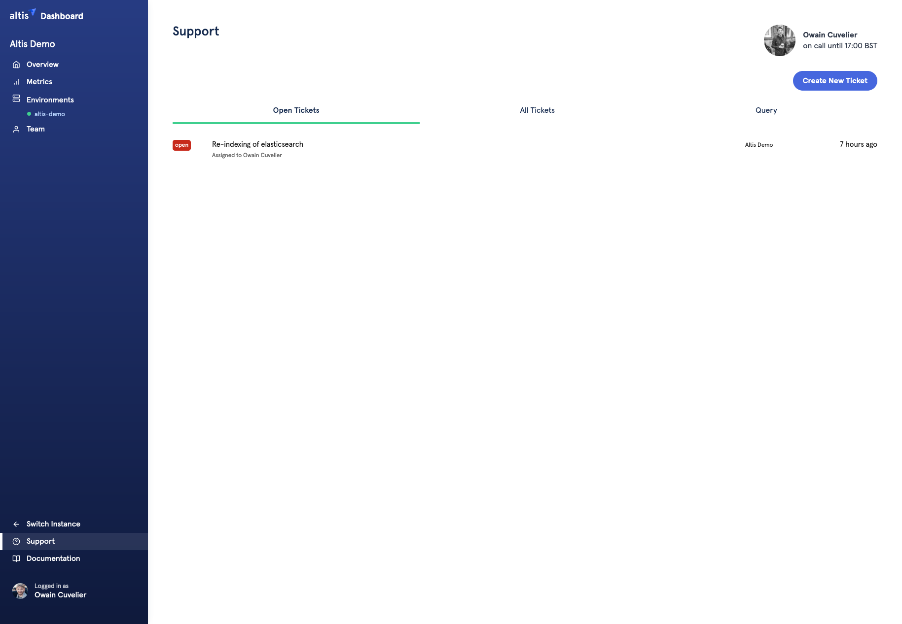
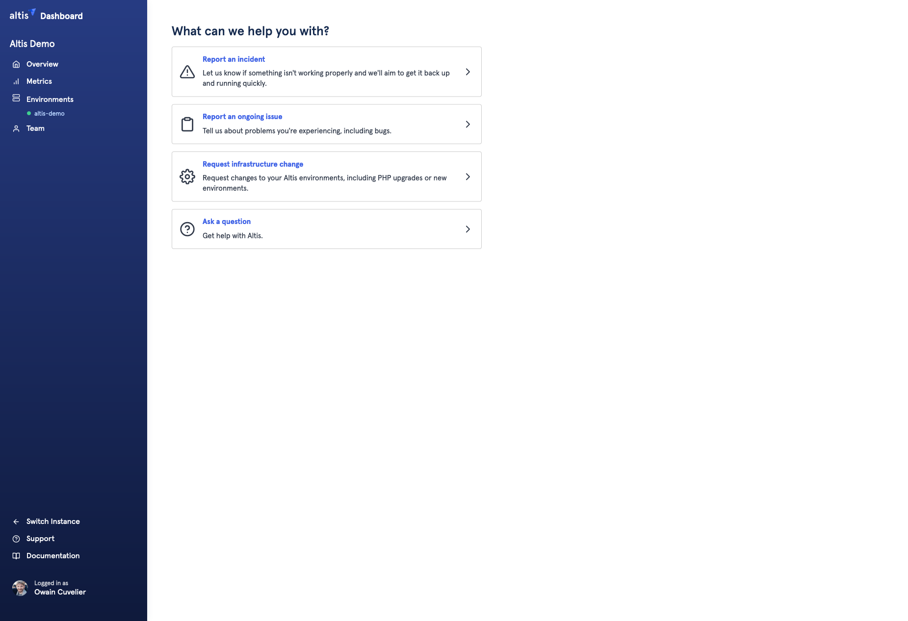
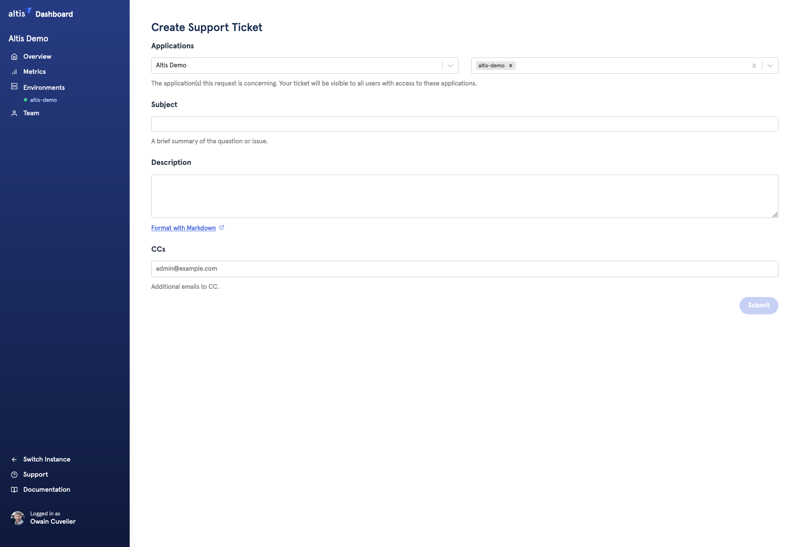

# Getting help with Altis

Everybody needs a little help sometimes, and the purpose of this guide is to help you through the proccess. 

## Altis Dashboard

Support happens via the Altis Dashboard. From your Altis Dashboard you will be able create, view, and reply to open support requests. 

To open a support request, first you'll have to [login to the Altis Dashboard](https://dashboard.altis-dxp.com/).

From there, you'll find the link to the support page in the bottom left corner of the screen. See below.

From the support panel screen you'll be able to view your open issues, all previous issues, and you can also query open and previously closed issues. Shown below.

To open a new support ticket, simply click the blue 'Create New Ticket' button.

## Create Support Ticket

### Selecting a support issue type

To help guide you to finding the right kind of help, there's four categories a support ticket can fall under. They all have their own labels, but we'll go over them quickly.

**Report an Incident**

Incidents are unplanned events that negatively impact service, or the quality of service of Altis. Be this part of the hosting infrastructure, or on the software side of Altis, if there is an issue which is causing an immediate business impact, this would be an Incident, and you can make a support request to help investigate.

From the support team side, Incidents get a rapid response. Alarm bells will ring, and we’ll put out the fires to get things running again by any means necessary.
If the site is down for example, select 'Report an Incident'.

**Report an ongoing issue**

Issues, also known as 'Problems' are the cause of, or can be the potential cause of future Incidents. If you're encountering a problem which could cause potential Incidents, or if you've run into a bug, select 'Report an ongoing issue'.

**Request an infrastucture change**

There’s an array of tasks that you might need help with. Typically, this might be the provisioning of an additional environment, or it could be an operation that requires a cloud engineer to run, such as upgrading the PHP version.

Tasks should be well described with detailed requirements and time scales. We cannot guarantee we will be able to service same-day requests, however if there is capacity to do so, we will.

**Ask a question**

Have a question for us? Ask!

If you have a technical question or require clarification on a feature, just open a support question and our support team will do their best to answer you.

### Filling the form

**Application**

Select the specific Application or select all Application(s)/Environment(s) that the support ticket concerns.

**Priority**

You can change the priority of a support issue if you need to. In most cases you shouldn't need to change this, but feel free to let us know if something is a priority. For example, the 'Urgent' priority should only be used if you are experiencing a service outage. The other priorities; low to high, can be used to indicate the order you would like us to tackle your open tickets in.

**Subject**

Short description of the support request.

**Description**

The body of the support request.

**CCs**

You can CC additional relevant parties to the support request if desired. They will receive carbon copies of the correspondence.

## Backup email addresses

In the event of an outage affecting the Altis Dashboard, we provide a backup method of contact via email.

This email address is only offered for emergency situations where an urgent response (L1) is necessary. Contacting this email will alert on-call engineers to your emergency immediately, and as such, must only be used for serious downtime or malfunctions.

Where possible, use the Altis Dashboard to file tickets instead, as this will ensure that your message is routed to the correct support staff.

The email of last resort is: sysops@altis-dxp.com
