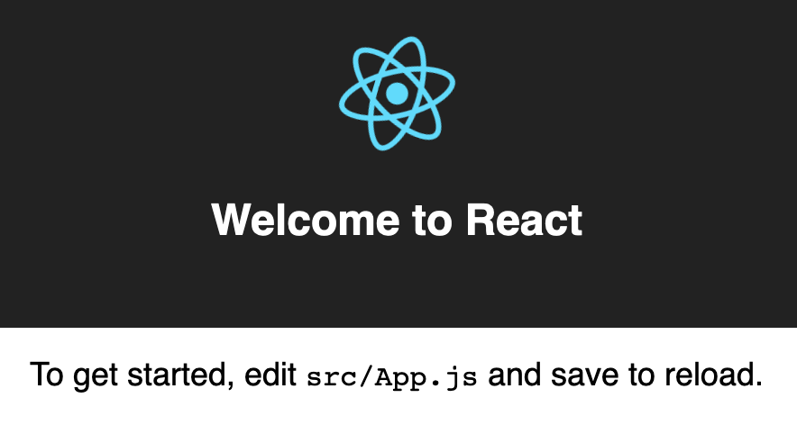
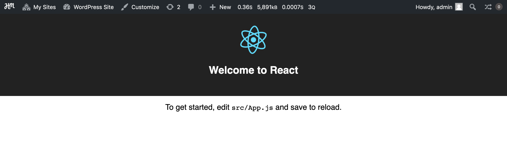
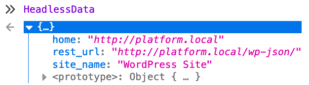

# Building a React App

This guide will walk through creating a semi-decoupled frontend with React. This frontend will act as a theme on your site, blending the agility and responsiveness of a React web app with the performance of a theme.

We'll first create a standalone React application, then turn it into a functional theme for use on your Altis site.


## Prerequisites

Before starting this guide, you should have some familiarity with React. We recommend following the [official React tutorial](https://reactjs.org/tutorial/tutorial.html) if you have not worked with a React project before. You should also have experience using the [create-react-app tool](https://github.com/facebook/create-react-app).

Additionally, you should have experience creating a theme. Consult the [First Theme](docs://getting-started/first-theme.md) documentation for more information.


## Initializing a new app

Start by opening your terminal and opening the `content/themes/` directory. We'll first create a standalone React app in this directory.

Use create-react-app (CRA) to create a React app, using `react-wp-scripts` for the WordPress integration:

```sh
npx create-react-app --scripts-version react-wp-scripts --php-namespace="HeadlessTheme\Loader" headless-theme
```

You should see the following:

```txt
Creating a new React app in /your/project/content/themes/headless-theme.

Installing packages. This might take a couple minutes.
Installing react-scripts...
```

Once this initial installation is complete, CRA will have created a standalone app in the `headless-theme` directory. Test this out by running it:

```sh
cd headless-theme
npm start
```

[Open your browser to the demo](http://localhost:3000/), and you should see the splash screen:



This means that your application is now successfully running in standalone mode.


## Add minimum theme requirements

To run the app as a theme, we need to add the required pieces for a [minimum viable theme](docs://getting-started/first-theme.md#theme-structure).

Copy all files across from the `base` theme; if you don't have a copy of the theme, you can download a new copy from [GitHub](https://github.com/humanmade/platform-skeleton/tree/master/content/themes/base).

Replace the namespaces in `functions.php` and `inc/namespace.php` with the project's namespace:

```php
namespace HeadlessTheme;
```

To distinguish this theme from other themes, replace your `style.css` with the following:

```css
/*
Theme Name: Example Headless Theme
Author: You
*/
```

CSS rules will be controlled via your React app, so you don't need any CSS rules in this file.

CRA created a PHP helper at `react-wp-scripts.php`, move this to `inc/loader.php`:

```sh
mv react-wp-scripts.php inc/loader.php
```

On your local site, head to [Network Admin > Themes](internal://network-admin/themes.php) and Network Enable the new "Example Headless Theme" entry. This will make the theme usable on your sites.

Next, head to the [Appearance page](internal://admin/themes.php) on a test site and Activate the "Example Headless Theme". This will activate the theme on your site.

Open [the frontend](internal://home/) and you should see an unstyled example page.


## Convert app to a theme

Now that we have the basic parts of the theme ready, we can connect the React app into the theme.

When we created the app with `--scripts_version=react-wp-scripts`, this automatically set up the connection on the JavaScript side. In particular, the `start` command runs `react-wp-scripts start`. This creates a manifest file with the relevant URLs, which PHP is then able to detect.

**Note:** If you are converting an existing app, follow the [react-wp-scripts installation instructions](https://github.com/humanmade/react-wp-scripts#installation--usage).

The next step is to connect the PHP side of the application. First, ensure the loader script is loaded by PHP; add the following to `headless-theme/functions.php`:

```php
require __DIR__ . '/inc/loader.php';
```

Next, we need to ensure the JavaScript and CSS generated for the app are loaded. In `inc/namespace.php`, replace the existing `enqueue_assets` function with the following:

```php
function enqueue_assets() {
	Loader\enqueue_assets( get_stylesheet_directory(), [
		'handle' => SLUG,
	] );
}
```

Finally, we need to add the root container for React into the page. create-react-app uses `<div id="root"></div>` by default, so add this to `index.php` in place of the welcome message:

```php
<?php

get_header();

?>
	<div id="root"></div>
<?php

get_footer();
```

Open [the frontend](internal://home/) and you should now see the React splash screen again. However, you should now see it with the Altis admin toolbar at the top of the page:



You now have a basic React-powered theme!


## Passing data to your theme

For your theme to be useful, you need to pass data from the backend to the frontend. This is done by outputting a global JavaScript variable which your frontend can then read.

The core functionality to achieve this is the [`wp_localize_script()` function](https://developer.wordpress.org/reference/functions/wp_localize_script/). Despite the function name, this function handles creating a global variable by encoding your data as JSON, and rendering it with the script.

In your `enqueue_assets()` function, create an array to hold data to pass to your frontend:

```php
$data = [
	'site_name' => get_bloginfo( 'name' ),
	'home' => home_url(),
	'rest_url' => rest_url(),
];
```

Then, use `wp_localize_script()` to output this data with your script. You'll need to choose a name for the global variable; we'll use `HeadlessData`.

```php
wp_localize_script( SLUG, 'HeadlessData', $data );
```

Your `enqueue_assets()` function should now look like:

```php
function enqueue_assets() {
	Loader\enqueue_assets( get_stylesheet_directory(), [
		'handle' => SLUG,
	] );

	$data = [
		'site_name' => get_bloginfo( 'name' ),
		'home' => home_url(),
		'rest_url' => rest_url(),
	];
	wp_localize_script( SLUG, 'HeadlessData', $data );
}
```

Reload the frontend in your browser and open your browser's developer tools. In the console, enter `HeadlessData` to see the available data:



You can now use this data in your React app. Note that you'll need to reference it as `window.HeadlessData` so that ESLint understands you are using a global variable.

Open `App.js` in your editor, and in the `<p className="App-intro">` element, use the data:

```js
<p className="App-intro">
	Welcome to <a href={ window.HeadlessData.home }>{ window.HeadlessData.site_name }</a>
</p>
```

Save the file, and the changes should automatically show in your browser. You should see the text replaced with "Welcome to WordPress Site", with a link to the site itself.

This same pattern can be further extended to other data in WordPress, such as posts and users. There are many ways to structure projects with this data, and many frameworks to work with this data. We recommend using [node-wpapi](https://github.com/WP-API/node-wpapi) or [Repress](https://github.com/humanmade/repress), but many other options are also available.


## Next Steps

Your React app is now fully ready to be used as a theme on your site.

To take advantage of the integration between the frontend and backend, we recommend enabling [server-side rendering](ssr.md). This will allow rendering your application on the server, improving render times and non-JavaScript experiences.
