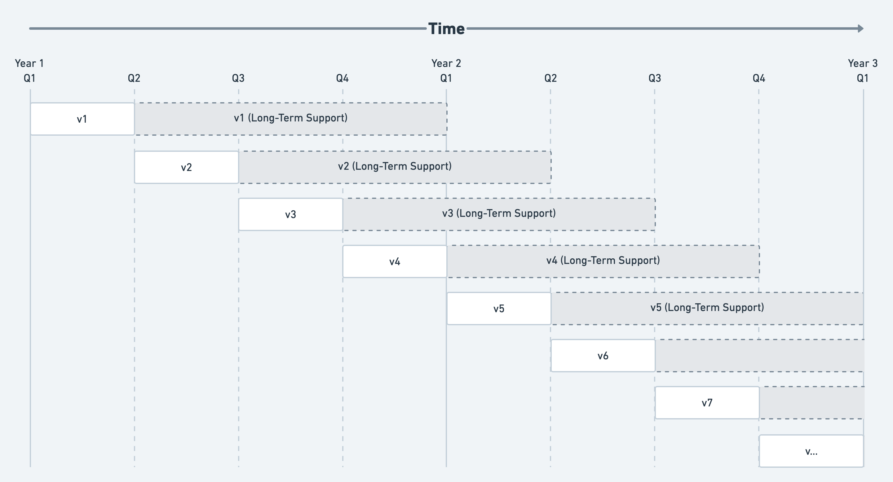

# Long Term Support

To provide stability to Altis users, major Altis releases will be supported for a minimum of one year after their release. The latest release of Altis will receive full support, while older releases will receive support under the "long-term support" policy.

[Learn more about how Altis releases work here](./altis-releases.md).

At all times, only a single major Altis version is fully supported, and is the "active" release. When a new major version of Altis is published, the previously active release moves into long-term support mode.

For example, if Altis has quarterly releases (i.e. four releases per year), each release will be the "latest" for 3 months, and will be supported under the long-term support policy for a further 9 months:

## Long-term support policy

The long-term support policy will provide limited support for older releases, while still providing a stable and secure product.

Releases covered by this policy will only receive bugfix updates, and will not receive new features. These bugfix updates will be provided to ensure stability of existing sites.

Additionally, these older releases may receive reduced support in other areas, such as documentation updates and customer support.

Generally, you should update to newer releases before LTS support ends however Altis will aim to maintain backwards compatibility with older versions as far as possible. Any breaking changes will be documented in the [upgrading guides](./upgrading).
