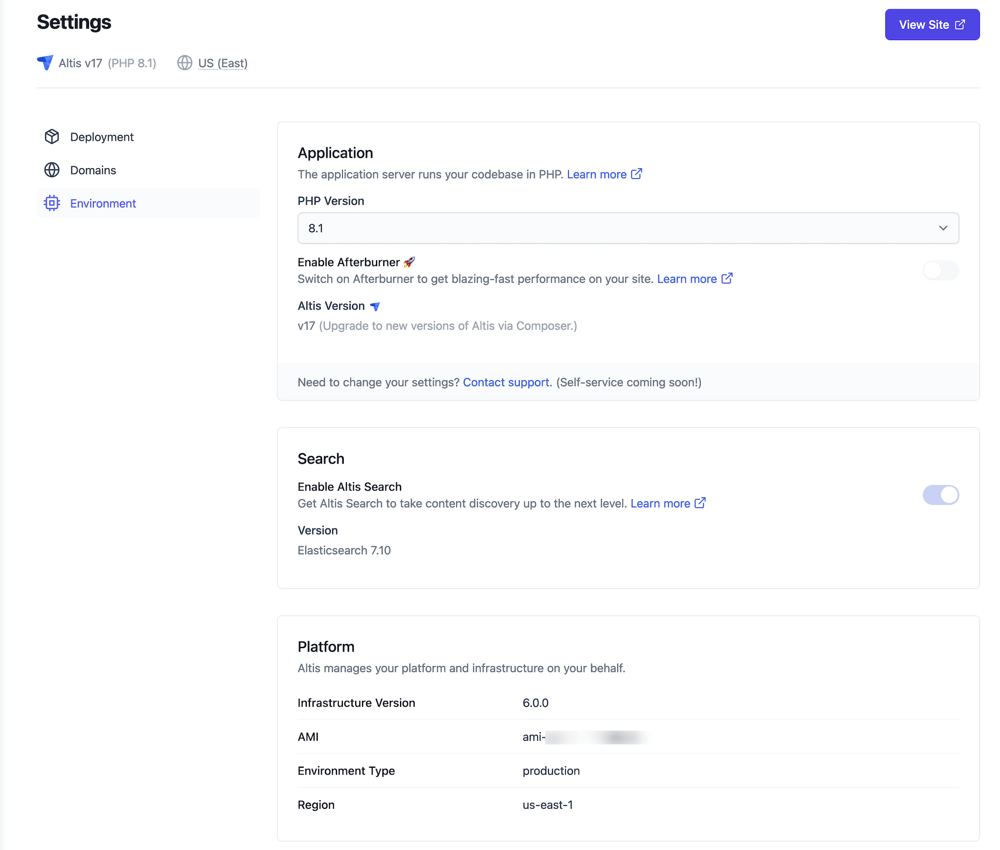

# Upgrading to v18

_If you are migrating from WordPress to Altis, check out
the [migrating guide](../migrating/) first._

To upgrade to Altis v18, edit your `composer.json` and change the version
constraint for `altis/altis` and any local environment modules to `^18.0.0`.

```json
{
	"require": {
		"altis/altis": "^18.0.0"
	},
	"require-dev": {
		"altis/local-server": "^18.0.0"
	},
	"config": {
		"platform": {
			"php": "8.1"
		}
	}
}
```

Once you have made these changes, run `composer update` and then run
the `wp altis migrate` command:

```sh
# For cloud environments
wp altis migrate

# For local server
composer server cli -- altis migrate
```

## Breaking Changes

## Changes to the Altis platform

### PHP

PHP 8.1 and 8.2 are our recommended versions of PHP for Altis. Note that there are a small number of exceptions to
Compatibility in the core WordPress CMS module. See the [WordPress
documentation on compatibility](https://make.wordpress.org/core/handbook/references/php-compatibility-and-wordpress-versions/)
for more information.

Refer to our [PHP Version Guide](docs://guides/updating-php/) for up-to-date
compatibility, testing and upgrading information.

## Headline Features

### WordPress 6.4.2

WordPress 6.4.2 brings a host of new features, bug fixes, and improvements as well as a new default theme. There are
hundreds of enhancements, new features, bug fixes, and more. The block editor alone has more than 1400 updates. These
include:

- improvements in performance,
- updates to accessibility, and
- modernising code and coding standards.

See the
[WordPress 6.4 Field Guide](https://make.wordpress.org/core/2023/10/23/wordpress-6-4-field-guide/) for more
information.

Of interest to developers are new or improved features such as:

- [Block Hooks](https://make.wordpress.org/core/2023/10/15/introducing-block-hooks-for-dynamic-blocks/)
- [Improvements to object caching](https://make.wordpress.org/core/2023/10/17/improvements-to-object-caching-in-wordpress-6-4/)
- [New options functions](https://make.wordpress.org/core/2023/10/17/new-option-functions-in-6-4/)
- Revisions are now supported for post meta on an opt-in basis

### WordPress 6.4 Backward Compatibility

- There are some changes to script loading. This change may have backwards-compatibility implications for the obsolete
  use of the clean_url filter
- [Attachment pages](https://make.wordpress.org/core/2023/10/16/changes-to-attachment-pages/) are no longer enabled by
  default for new installs.
- Replacing hard-coded style tags with wp_add_inline_style() may require some developer action

### Altis Dashboard

- We reworked the login screen to be more informative and a little prettier
  
- SES error messages are now displayed better in the dashboard
- Status information in the dashboard has been improved including the addition of an environment page
  

### Altis Core improvements

We have incorporated many updates to modules and libraries in Altis to bring in important bug fixes and improvements.
