# Configuring Altis admin

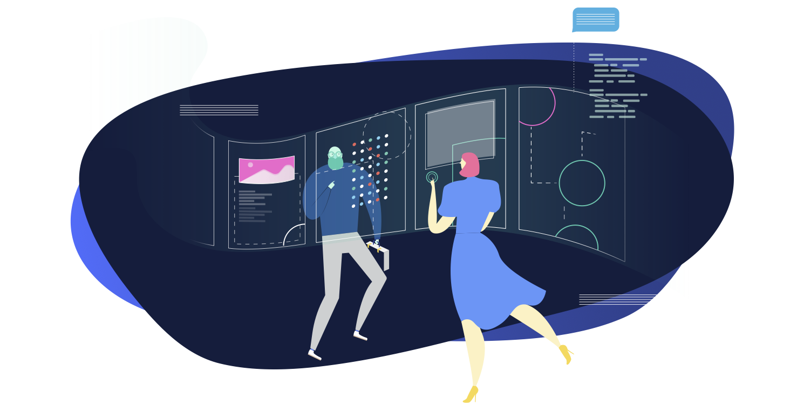

Customisation and personalisation aren’t just for your audience. You can configure Altis to suit the way you prefer to work. Change the **layout**, reduce **distractions**, set different **defaults**. Whatever helps your workflow, means fewer clicks, or just arranges things how you want.

## Configuring the post and page editor

You’ll find configuration options when you click the **three dots** on the right:
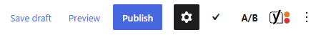

### How to change where the block toolbar displays

You know how a toolbar appears **above** each block you’re working on:
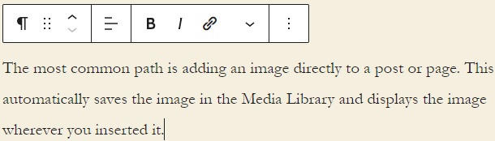

Click **Top toolbar** in configuration: 
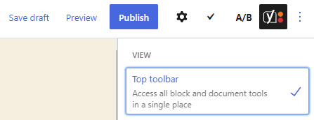

The **toolbar** stays visible at the top of the page. Instead of only appearing when you click in a block. See how it slots in snugly next to the other WordPress menu:
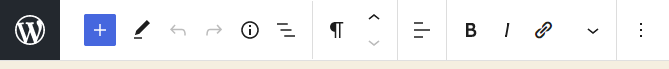

The toolbar reflects the selected block. So make sure you’ve selected **the block you want to edit** first. 

### How to highlight blocks you’re working on

Want a quick way to know **which block** you’re working on? Use spotlight mode:
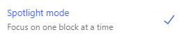

The selected block stays in the **foreground** for you to focus on. Meanwhile, the other blocks fade:
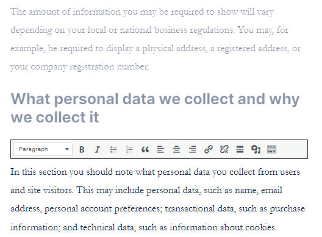

### How to remove distractions 

Fullscreen mode is for those times you want to just **focus** on your block editor. The dashboard stays hidden away, out of sight and out of mind:
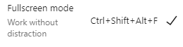

### How to switch between visual & code editors

So far we’ve looked at how to work **visually**: 
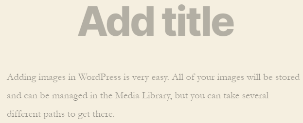

This is known as the **Visual Editor**. 

If you prefer to code, you can switch to the **Code Editor**:
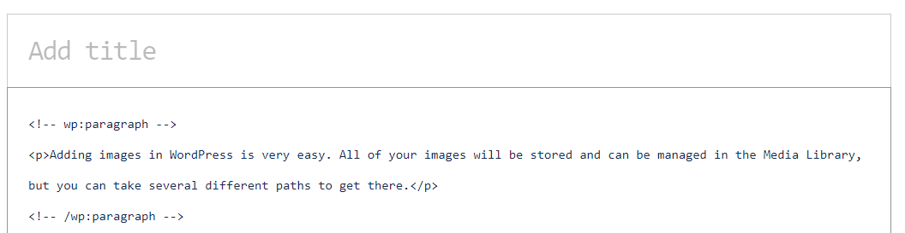

Either way, it takes **just a click** on **Visual Editor** or **Code Editor** to switch:
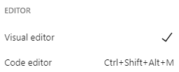

### How to access plugins

If a plugin adds a configuration panel to the block editor, you can access the plugin by clicking its name:
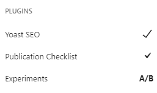

### How to manage blocks

Sometimes you can have **too much of a good thing**. Yes, even with Altis. By default, you have a lot of blocks, text, media and other elements at your fingertips. 

If there are blocks you never use, you can remove them from the list of blocks. Click **Block Manager**:
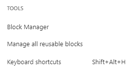

This opens all the available types of blocks:

- Experience blocks
- Text
- Media
- Design
- Widgets
- Embeds
- Yoast structured data blocks

To add/remove any of these, click the **tick box**. You can remove all the blocks in a category or individual elements within categories:
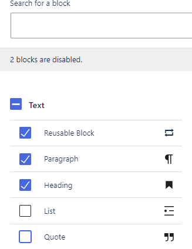

### How to take a shortcut and click less

To get the most out of the block editor and work faster, use the many keyboard shortcuts available. Your mouse-clicking hand will thank you. Check them out at the bottom of configuration:

Click to view:

- Global shortcuts
- Selection shortcuts
- Block shortcuts
- Text formatting

### Welcome guide

Click Welcome guide for a four-step walkthrough of the block editor:
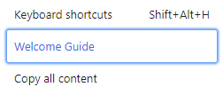

### Copy all content

Click this to copy all blocks and their contents. 

### Help

Click this to visit WordPress’s article on the WordPress Editor:
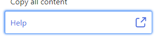

You’ll see clickable toggle buttons to:

- **Include pre-publish checklist**
    Include a checklist users have to review before publishing content. For example, this will appear in the sidebar after clicking Publish on a draft page or post:
    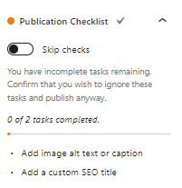
- **Document settings**
    Choose the dropdown options that appear in the sidebar when editing a post or a page:
	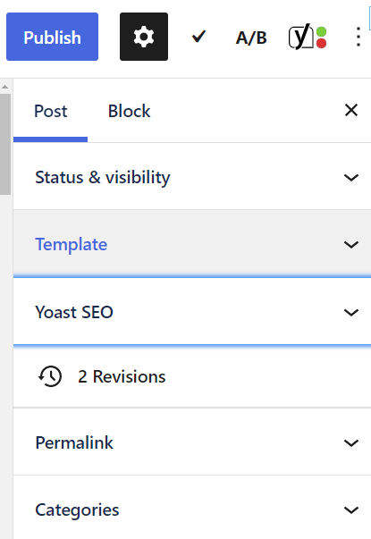
