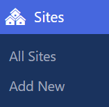
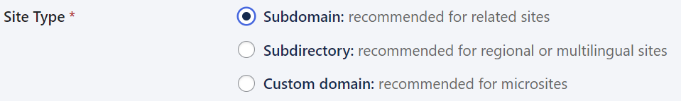
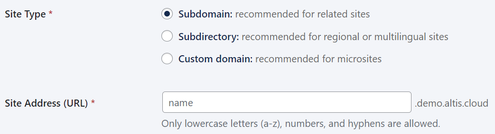
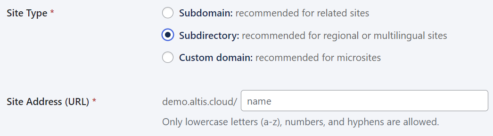
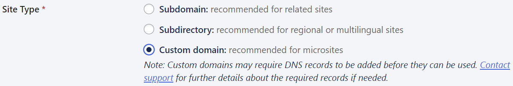
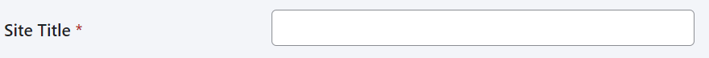
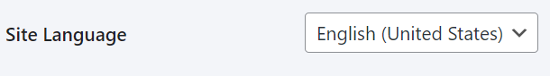
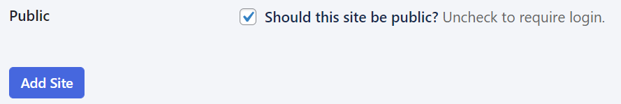
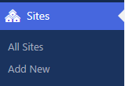
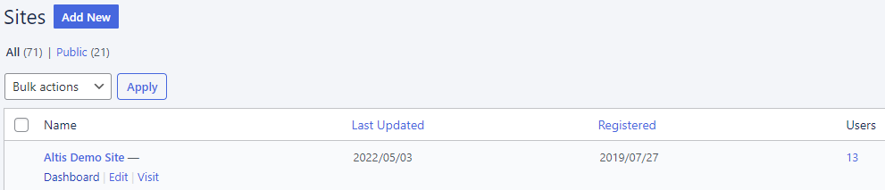

# Creating new sites

Sites are websites that are **part of your main website**. New sites can all use your main website’s code, plugins, and data. You
can then modify them as much or as little as necessary.

## How to add a new site

Only **Super Admins** can add new sites.

Click **Sites > Add New**:

Choose the site type:

Enter the site address. Letters need to be lowercase, and you can also use numbers and hyphens. Depending on the site type, Altis
automatically updates to show how the full URL looks:

Add the site title:

Choose the site language:

Tick to make the site **publicly available, crawl-able and indexable** by search engines. Uncheck to discourage search engines and
make the site require a login. Then click Add Site:

The site is now available in your list of sites. Click **All Sites** in your dashboard to view:

This shows the All Sites list. **Hover** over the site you want to work on, and click **Dashboard**:

