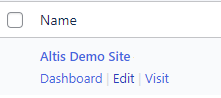

# Multisite

If you’re a **Super Admin** user, you can run multiple websites, or multisites, from one dashboard. These can be powered by one codebase, with functionality and plugins applied to all or some sites. This means less code on your network, with one set of core WordPress files, and less demand on server space.

## Multisite use cases

- **Ecommerce**
    Localise sites with local products, languages and currencies
- **Intranets**
    Create different sites for different divisions of the same company
- **Microsites**
    Create multiple sites while sharing the same hosting
- **News**
    Regionalise content sites from a national or international site

## Multisite types

There are three ways to set up a multisite::

- **Subdomain**
    Useful if you’re allowing users to create sites with some connection to your network. The subdomain appears first: **subdomain.example.com**
- **Subdirectory**
    This option keeps all sites on your domain. Users just create a subdirectory such as www.exaple.com/subdirectory
- **Custom domain**
    A completely different domain from the one used to set up the network.

## How to [create new sites](creating-new-sites.md)

## How to view multisites

Hover over **My sites > Network Admin** and click **Sites**:

This shows you all the sites on the network:

You can see:

- Site name
- Last updated
- Registered date
- Number of users
- Whether [ElasticPress](https://www.elasticpress.io/) is enabled

## How to edit multisites

Hover over the site you want to edit and click **Edit**:

You can make edits across four tabs:

### Info tab

Edit dates when the site was registered or updated. Change whether the site should be available to the public and appear in search engine results, and/or whether it should be marked as for a mature audience (rated X):

### Users tab

Click to edit (including changing permissions), remove, view and reset passwords. You can do this individually, or use the bulk action dropdown:

### Themes tab

Shows all the themes on the site. To activate a theme for a site, visit the specific site’s dashboard:

### Settings tab

Some complex settings cannot be changed on this screen. These will say SERIALIZED DATA:

The rest of the settings can be changed as normal.
