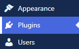
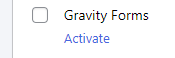

---
title:
order: 0
---

# Plugins and themes

You’ll find a list of plugins and themes ready and waiting for you. All are either built by us or come from trusted and established third parties. We recommend this selection because each one is:

- **Built and maintained** by WordPress specialists (for example, the WordPress Importer plugin is from WordPress.org)
- **Simple** to install and use
- **Easy** to review and approve by your software engineers 

## Plugins

You’ll find a list of plugins waiting for you—either from Altis or added by your developers.

### How to view a plugin

In your dashboard click **Plugins**:

Each plugin comes with a short description. For **more info**, you can click the plugin creator’s name to visit their website: 

### How to activate a plugin

Imagine you want to **start using forms** on your website. For this example, Gravity Forms is the plugin you need. Click **Activate**:

Gravity Forms is run by a third party. That’s why you’ll be asked to **register** with them and get a license key to use:

You can then click **Settings** to start setting up your forms:

A **Forms** menu will also appear in your dashboard:

#### Network plugins

Some are set by default to run on all your websites. This saves you having to activate each one individually. These plugins will say “Network”. For example, Human Made’s plugin for the [Global Media Library](../media/global-media-library.md):

## Themes

You can find themes under **Appearance** in the dashboard:

You can see which theme is **active** (and click to **customize**):

You can also see other themes available for your website. Hover over to **view details**, **preview** a live version, or **activate**:

### How to customize your theme

Some basic themes are ready to go “out of the box”. However, you may also have different customisation options depending on your theme. 

Some of these areas are detailed below. After any customisation, it’s worth visiting your website using some different devices. Ideally mobile, desktop, and tablet. Just to see how everything looks on **different-sized screens**.

Under **Appearance** click **Customize**:

#### Site identity

Here’s where you can customize the website’s **name**, **tagline** and **logo**. You can also add a site icon (favicon). This will appear in a visitor’s browser tab, bookmarks and browser bar.

#### Colors

Your theme may allow you to customize your website’s **default background** color. Changes also affect your **header** and **footer** backgrounds. 

Your theme may also allow you to customize the **primary color** for links, buttons and featured images. Click **Custom** to choose a color:

If you’re going for a **multi-colored** customisation, check you have enough **contrast** between background and foreground. You can find tools online for this – search for “**online accessibility checker**”. This tells you if your color combinations make it hard for people to read.

#### Theme options

Depending on your theme, you could also include a **search bar** in your header. If you’re publishing posts, you can also choose to display an **author bio**. You can also choose to show **full texts** or **summaries** on archive pages.

#### Cover templates

The page or post title appears as text, overlaid on the featured image. 

#### How to use menus

Also, depending on your theme, you may have the option to have different menus showing on your website in different places. These are useful if you want to:

- Show fewer menu options on **mobile** than desktop
- Create a **footer** menu with different links compared to your main menu
- Include **links** to other websites, maybe from/to your corporate site or other microsites

Click **Create New Menu** to get started:

Give the menu a name and choose where you want the menu to appear:

- **Desktop horizontal**
    Show all menu options to desktop users
- **Desktop expanded**
    Your menu looks like a mobile menu for desktop users. Users click to open the menu options
    
- **Mobile menu**
    What mobile users will see on
- **Footer menu**
    The menu users see when they scroll to the footer 
- **Social menu**
    This shows icons for your social media channels

For this example, we’ll create a footer menu. Tick the **Footer Menu box** and then click **+Add items**:

You can then link to areas within your website (pages, posts, categories, tags, custom search results). 

You can also link to **external websites**. Add the URL and link text, and then click **Add to menu**: 

The menu is now ready to be added to your website. You can do this by using a **widget** (more on widgets below).

#### Widgets

Different themes can offer different  widgets for your website, sidebar, and other areas outside your pages and posts. They’re those little extra elements that help bring things to life. You can use widgets to show extra content, tools such as search boxes, images, and much more.

When in a page or post, add a new block. You can then search for, or scroll to, the widgets:

Click **Appearance > Widgets** in your dashboard:

You’ll see the current areas where widgets can be placed. These areas change depending on your theme. In this example, the areas are in the footers:

Click a dropdown to view the widgets in each widget area. After clicking the Footer #1 dropdown, we can see there are widgets for **search**, **navigation menu**, and **recent posts**:

Click any of these widgets and a toolbar appears:

These options will vary depending on the widget type. Here’s what’s available when you click the **Search widget**. From left to right click the icon to:
- Change the block **type** or **style**:
	
- **Drag** the widget to change its position:
	
- Move the widget **up** or **down** one level:
	
- Change the widget’s **horizontal** alignment:
	
- Change the widget’s **vertical** alignment
	
- **Move** to another widget area:
	
- View more **options**:
	

When you’ve made your changes, click **Update**:

To **add a block to widget**, click the + sign:

Choose the **block type**. Then click or drag to where it should be displayed. The example below shows a heading block being added above the search bar:

#### Homepage settings

You have two options for what to show on your homepage:

- **Latest posts**
    Is your website mainly about publishing content, news or blogs? This option is great for showing newly published posts
- **Static page**
    You can also show visitors one of your pages, such as a welcome page. Where content tends to stay the same

#### Additional CSS

Here’s where you can add extra code to style your website.

#### Yoast SEO breadcrumbs

Set up breadcrumbs for users to:

- Know where they are on your website
- Click to get around your website
- See a page/post trail in search engine results

[Yoast’s guide to all things breadcrumb-related](https://yoast.com/help/implement-wordpress-seo-breadcrumbs/)

## “I need a plugin that isn’t listed”

No problem. [View the developer documentation for third-party plugins](https://docs.altis-dxp.com/getting-started/third-party-plugins/).
