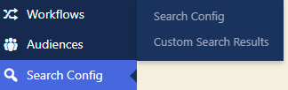

# Search

You can configure Search in Altis to make it more of a, well, **human experience**. Similar to search engines. Where results can show **related** words, different **spellings**, and handle **typos**. 

## Content types

By default, the following content types are indexed:

- Posts
- Pages
- Media
- Custom post types
- Post meta (unless the published post is password protected)
- Post terms
- Post author
- Users
- User meta
- Terms
- Term meta

## File types

Planning to **publish documents**? No problem. Upload any of these file types and they can also be indexed for your search results. You may need a developer to [activate indexing](https://docs.altis-dxp.com/search/indexing/) first:

- PDF
- PPT
- PPTX
- XLS
- XLSX
- DOC
- DOCX

## How to configure your site search

Scroll down your dashboard and click **Search config**:

### Synonyms to show related words

Here’s where you can make your **results work for all your audiences**. For the times when they can’t find the exact word, use regional spellings/slang, or simply make a typo:

Add alternative versions of words (one entry per line) for: 

- **Acronyms & initialisations**
	Add these as well as the full search terms. For example, include “CPU” next to “central processing unit”. 
- **Regional variations**
	Add different versions of words, so “trainers” appear in a search for “sneakers”.
- **Brand names & product names**
	Make search results match whether someone searches “vacuum cleaner” or “hoover”, “ipad” or “i-pad”, or makes a common mistake such as “calender” instead of “calendar”. Add the variations, separated by commas, and then =>. Then add the word that the terms relate to. Like this: **ipad, i-pad => Ipad**
- **Languages**
	Altis also supports Japanese search (when your site’s language is set to Japanese)

You can enter synonyms manually, and/or upload a .TXT file. Bear in mind any manual entries override your .TXT file. That’s why it’s usually easier to **stick to one method** or the other.

### Stop words that won’t appear in search results

These are words like “it”, “of”, “and”. Add these if you don’t want them to clog up your search results. 

## Search analytics

Accelerate and Enterprise tier customers have access to **Altis Analytics**. If your website displays the search bar, you’ll be able to see the words and phrases visitors are typing in. 

Under **Dashboard**, click **Analytics**:

Click **Last 7 days** to change the date range:

Then look under **Search terms** to see the results over your chosen time period:

## How to connect site search to Google Analytics

If you’re not on Altis Accelerate or Enterprise tiers, you can [connect your site search to Google Analytics](https://support.google.com/analytics/answer/1012264).
