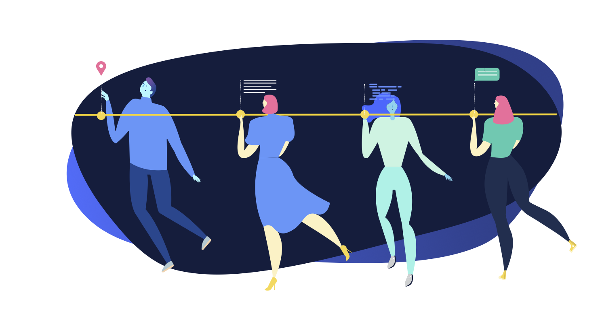

# Collaboration

Here’s how to keep everyone working on your website aligned, consistent, and
collaborative. Even when they’re working separately on different pages (and
posts). Explore how to create multiple roles, schedule publishing times, and
design shared templates.

## User roles

Let’s start with who you’re collaborating with. Your **users**, and their **roles**. These will look familiar if you’ve ever ventured into WordPress-related surroundings. Naturally, you get some Altis-powered features on top.

### What different roles can do: 

#### Administrator

- Access to all administration features within the site

#### Editor 

- Publish and manage their own and other users’ posts and pages
- Upload files
- Manage categories

#### Author  

- Publish and manage their own posts
- Upload files
- Manage categories

#### Contributor 

- Write and manage their own posts (can’t publish)

#### Subscriber 

- Manage their profile

#### Guest author 

- Be attributed to a page or post without having a user account

### Differences with Altis compared to WordPress

- Editors can create **Guest Author** accounts

[More on Guests & Multiple Authors](guest-and-multiple-authors.md)
