---
title:
order: 0
---

# Collaboration

Here’s how to keep everyone working on your website aligned, consistent, and collaborative. Even when they’re working separately on different pages (and posts). Explore how to create multiple roles, set up editorial workflows, schedule publishing times, and design shared templates.

## User roles

Let’s start with who you’re collaborating with. Your **users**, and their **roles**. These will look familiar if you’ve ever ventured into WordPress-related surroundings. Naturally, you get some Altis-powered features on top.

### What different roles can do: 

#### Administrator

- Access to all administration features within the site

#### Editor 

- Publish and manage their own and other users’ posts and pages
- Upload files
- Manage categories

#### Author  

- Publish and manage their own posts
- Upload files
- Manage categories

#### Contributor 

- Write and manage their own posts (can’t publish)

#### Subscriber 

- Manage their profile

#### Guest author 

- Be attributed to a page or post without having a user account

### Differences with Altis compared to WordPress

- Administrators and Editors can **clone** and **amend** pages
- Editors can create **Guest Author** accounts

[More on Guests & Multiple Authors](guest-and-multiple-authors.md)

### SEO roles

These roles are for users in charge of getting your content indexed and ranked by search engines. You can give them freedom to edit the **SEO-related settings**. They’re based on the [Yoast definitions](https://yoast.com/seo-roles/) of:

- SEO Manager
- SEO Editor

## Create workflows

Here’s how to publish content faster, manage growing teams, and free up time. You can **create workflows** that do some of the routine stuff for you. Use for **checklists**, quality **control**, or requesting **eyeballs** to view and sign off content:

- Alert editors when new articles are ready for **review**
- Notify **compliance** when legal content has been edited
- Message **social media** managers when readers post comments

### How to add a workflow 

Click **Add New** under **Workflows** in your dashboard:
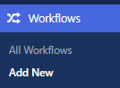

**Add a title**. For this example, the workflow will notify the governance team when a finance-related article is ready for review.
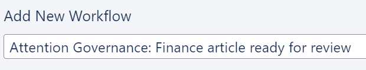

Click the dropdown under **When should the workflow run?** You’ll see different options for your workflows. This example requires a review before publishing. So we’ll choose **A post is pending review**:
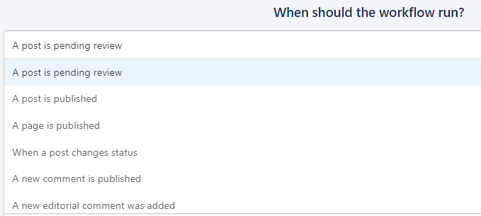

Click **when you want the workflow to run**. This automatically opens up a message box:
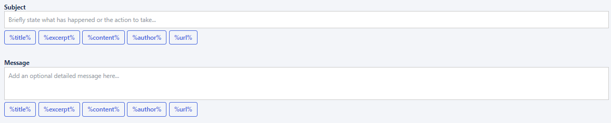

Just like an email, you can add a **subject line** and **main message**. Enter your own text and use any of the dynamic tags. These automatically update based on the published:

- Title
- Excerpt
- Content
- Author
- URL

The example below will show the post title and author on the subject line. 

The **URL** will be in the main body of the message, along with **buttons** to preview, edit and publish:
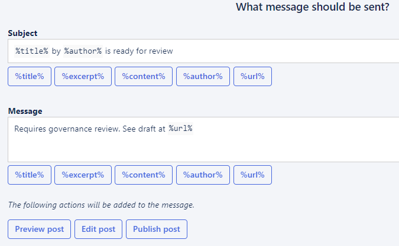

Now you can choose **who gets the message**:

- Roles
- Specific users
- All users
- Assignees
- Post author

Some options automatically open further dropdowns. For example, click **Roles** and then choose the role:
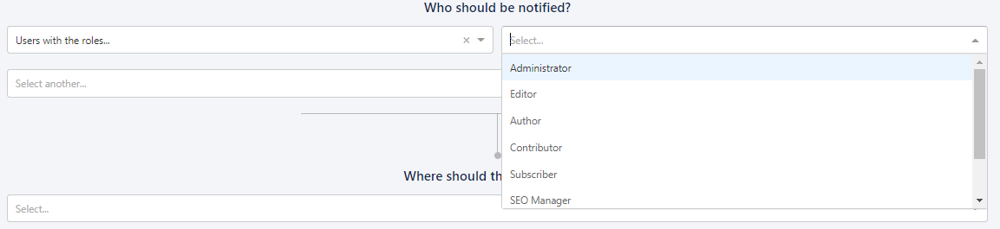

Then select **where to send** notifications:
- **Email**
    To start a group email conversation, tick the Send group email box:
	
- **Slack**
    Notifications go to a channel to keep everyone updated:
	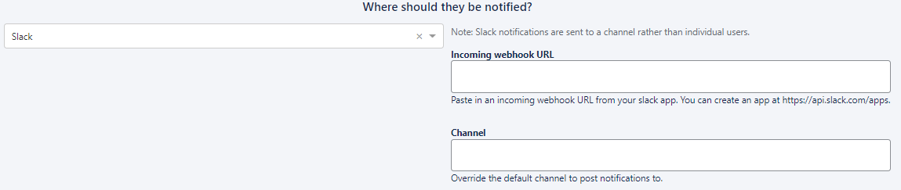
- **Dashboard**
    Whoever receives the notification can search and filter the content inside the Dashboard:
    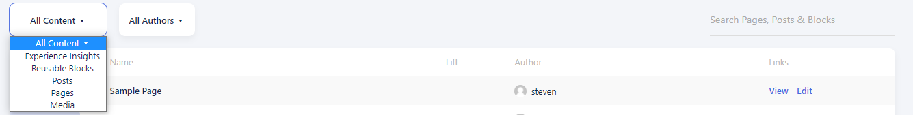

That’s it, you’re ready to go. Click **Save** and toggle **Enable** to start the workflow:
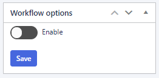

### How to make comments in a workflow

Got something to say about a post, page or media file? Make a comment, and assign it to someone. This can be viewed by everyone in your team, giving you a content progress tracker.

Open the page or post, scroll down and you’ll see **Editorial comments**:
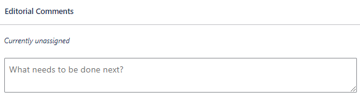

Add your comment in the **What needs to be done next?** box. Click the Assignees dropdown and choose who should be assigned the comment:
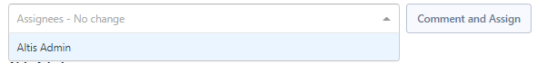

Assignees now appear in the pages and posts lists:
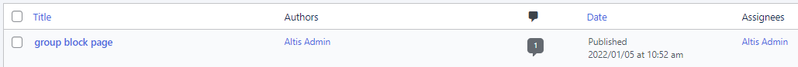

Users can also click **Assigned to me** to filter the list:
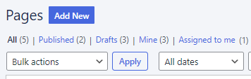
