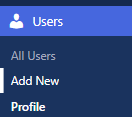
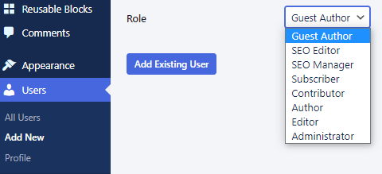
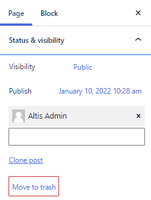
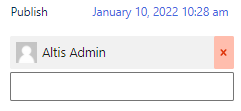
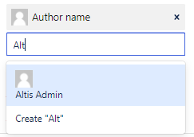
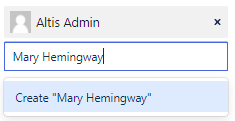
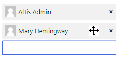

# Guests and multiple authors

Want to publicly recognise your content creators and contributors? No problem—attribute them as authors. You can do this for both posts or pages. There are also options for managing—and showcasing—both in-house and external authors.

## Guest authors

Maybe you want to publish some content on behalf of the CEO. or perhaps a ghostwritten thought-leadership blog for a senior executive. The sorts of people who often don’t have time to login, upload and click Publish. 

That’s when Administrators can use the Guest Author feature. There’s no need to create or issue logins. Instead, the Administrator simply creates a Guest Author and attributes the content to them.

### How to make someone a guest author

In the dashboard under Users, click Add New:

You can now enter the person’s name and click the role dropdown to assign them as a Guest Author:

## Multiple authors

Want to give recognition for a team effort? Administrators and Editors can attribute a piece of content to multiple authors. 

### How to add multiple authors

In the sidebar of the page or post, click Status & visibility:

You’ll see the name of the current author (in this example it’s Altis Admin). 

To remove the author name, click the X:

To add an author name, start entering their name into the field. If the author already exists as a [user](user-management.md), click their name and avatar:

If the author doesn’t already exist as a user, an Administrator or Editor can enter their name and click Create:

Of course, adding multiple authors means you can choose which author name appears first. Perhaps when giving props to the main creator. Maybe for showing hierarchy. Or when putting names in a particular order (is it Hardy and Laurel, or Laurel and Hardy?) 

Hover over a name to click, drag and rearrange:

## Notifications

You can also keep authors updated on what’s happening with their content. By default, authors can be emailed whenever:

-   Someone comments on their content 
-   They’re assigned to a post or page
-   Their post or page is published

Of course, for some Guest Authors this won’t necessarily work. At least, for the Guest Author accounts that don’t include an email address. To solve this, consider setting up a [workflow](../insights/workflows.md) that notifies someone connected to the person instead. For example, if you published a post on behalf of a CEO, create a workflow that notifies their PA.
