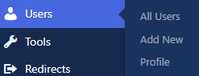
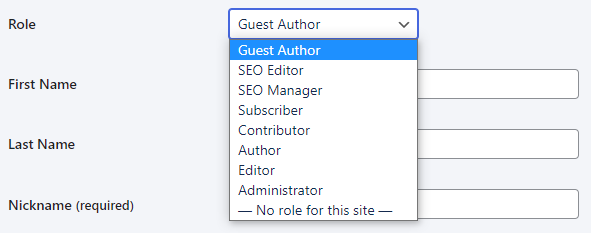

# Managing roles

Permissions are the individual capabilities that make up a [user role](roles-and-permissions.md). Each role comes with different
permissions. You can assign different roles depending on the permissions you want a user to have.

For example, you can give some users a role with permissions to draft pages. Other users can be assigned a role with permissions to
publish pages. Other users can have permissions to manage the pages.

## How to manage roles

Head to **Users** in your dashboard:

For **existing user** permissions, **hover** over their name and click **Edit**:

For **new users**, click **Add New**:

Click the dropdown next to **Role**:

Permissions are related to the [Role](roles-and-permissions.md).

## Role permissions

### Super Administrator

This role has the broadest level of permissions across your entire network. They can do everything on each of
your [websites](../administration/multisite.md). For security reasons it’s best to limit this role to as few people as necessary.

### Administrator

Administrators have similar permissions to the Super Administrator–for a single site. The set of permissions are most suited to the
site owner. This includes being able to remove users, change passwords, switch themes and export/import content.

### Editor

This role has permission to publish and manage pages and posts of other users. This includes reading other users’ private pages and
posts, managing categories, and moderating comments. They can also create Guest Author accounts. The permissions are mainly for
managing content and writers, rather than making technical changes.

### Author

Authors have permission to publish and manage their own posts, including deleting their own posts they’ve previously published. They
can upload media and create reusable blocks, including editing and deleting their own blocks. Authors can also choose existing
categories and add their own tags.

### Contributor

Contributors can write and manage their own posts – but can’t publish or upload media. So if you’re asking users to include images
in pages or posts, the Contributor role doesn’t offer enough permissions.

### Subscriber

This role can manage their own profile on a website. They can also access private content to read and/or leave comments, but can’t
create content. This is the most limited set of permissions, often suitable when you only want to give a user permission to login
and view content.
