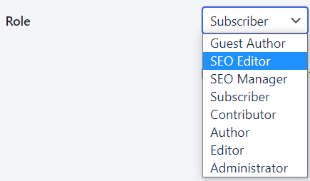

# Roles and permissions

You can assign roles to users working on your website. Each role can include
different permissions. These permissions define what users can and cannot do on
your website.

## Role summaries

These will be familiar if you’ve used WordPress before.

### Super Administrator

Has access to all administration features (including setup and upgrade) of
your [multisite networks](../administration/multisite.md). If you’re using
multisite networks, only this role has permission to post unfiltered HTML,
including `<iframe>`, `<embed>` and JavaScript.

### Administrator

Administrators have access to all administration features within a single
website. It’s the role with the most power on your website. From controlling
content and users, to managing plugins and themes. For single sites,
Administrators (and Editors) can also post unfiltered HTML. Consider them as
your site owner when deciding who to assign as Administrator.

### Editor

Editors can publish and manage their own and other users’ posts and pages. They
can also moderate comments and manage categories and links. This role is
primarily focused on content, so can’t make changes or updates to themes or
plugins. Editors can also create and edit reusable blocks, but they can’t delete
them.

### Author

Authors can create, publish and delete their own posts. This includes uploading
media files and creating reusable blocks–and editing and deleting reusable
blocks they’ve created. This role can also add existing categories and tags.
Authors can also view comments (including pending) but can’t moderate, publish
or remove them.

### Contributor

Contributors can create and edit their own posts. This includes being able to
add existing categories and create their own tags. However, this role can’t
publish posts or upload media files. This is a relatively safe option when
you’re training new writers. You just need to decide if being unable to add
images is an issue.

### Subscriber

Subscribers are users who have to login to view content. This makes the role
suitable for viewing member-only or private posts and pages. A subscriber can
create a user profile, leave comments while logged in, change their password,
and choose to receive notifications.

### Guest author

Guest authors can be attributed to a page or post without having to register or
be assigned a user account.

## Roles with extra Altis permissions

- Editors can create **Guest Author** accounts

## Roles with plugins

Some plugins can generate additional roles. For example, the SEO plugin from
Yoast. That’s why there are two extra roles from Yoast in the image below:

