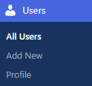
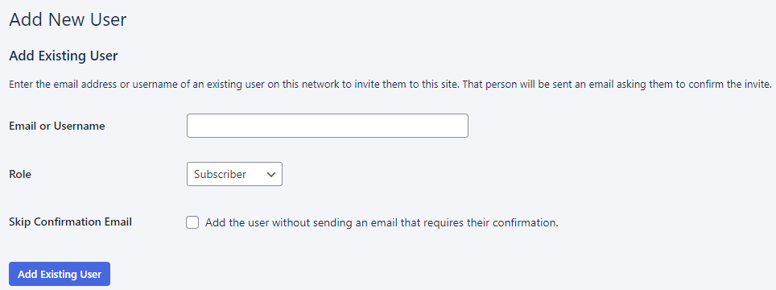
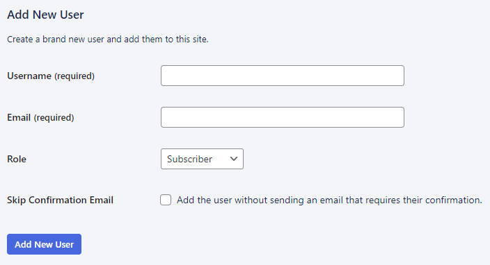
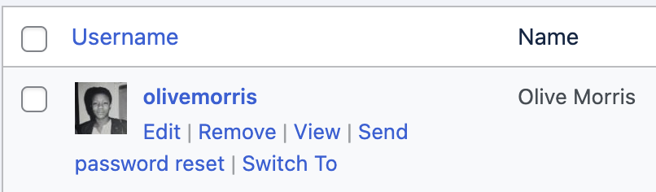
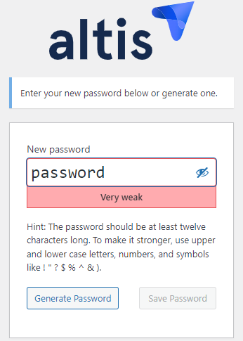
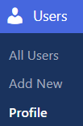
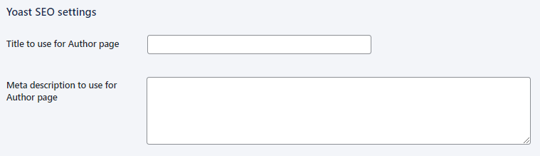
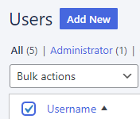
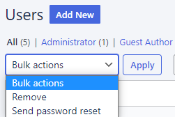

# User management

Managing people can be complicated–but managing your website users isn’t. Even when you’re dealing with people coming and going. Or when they get promoted at work, move roles, or leave. You can manage all that with **just a few clicks**. 

## How to add users

In your dashboard click **Users > Add new**:

### A bit about user roles

You’ll be assigning every user with a role. So before we dive into the “how-to”, here’s a summary of their [roles and permissions](roles-and-permissions.md):

- **Administrator** – has access to all the administration features within the site
- **Editor** – can publish and manage their own and other users’ posts and pages
- **Author** – can publish and manage their own posts
- **Contributor** – can write and manage their own posts but can’t publish
- **Subscriber** – can manage their profile
- **Guest author** - can be attributed to a page or post without having a user account

### Differences with Altis 
- Administrators and Editors can **clone** and **amend** pages
- Editors can create **Guest Author** accounts

### Adding existing users already on your network

If you’re running a [multisite](../administration/multisite.md) you may already have multiple users in your network. Invite them to work on your site by:

- Entering their email address or username
- Assigning a role
- Deciding whether to tick and send a confirmation email
- Clicking **Add Existing User**
	

### Adding new users

You just have to:

- Give them a **username**
- Enter their **email** address 
- Assign a **role**
- Decide whether to skip sending a **confirmation email**. This email contains a link which the recipient clicks to **activate their account**. If they **don’t click**, they **can’t login** and the username can’t be reused within 24 hours. If you don’t tick the box, the user account is created without sending an email to the recipient. You will need to instruct them to reset their password.
- Click **Add New User**

### How to edit users 

Click **Users**:

#### Remove, edit, reset passwords

This opens your list of users. Hover over a user and you’ll see the following options to click:

- **Edit** the user’s details and profile
- **Remove** the user’s account from the site (they’ll no longer have access)
- **View** the user’s list of posts on the website
- **Send password reset**. This can be for [README](../security/README.md) reasons such as stolen passwords or suspected breaches. Or simply for a forgotten password request. The user receives an email with a link that takes them to a password reset page. Altis can automatically generate a password or the user can create their own password. Altis will advise on password strength as you type, such as the “very weak” example below:

After resetting the password, the user is **automatically logged out of any other devices** they may be using.

### Editing user profiles

Depending on a website’s theme and plugins, Administrators can edit user profiles and users can edit their own profiles. Click **User > Profile**:

Options may include:

- Social media URLs
- Avatar images
- Recommended age ratings for the image (if the image is not suitable for the maturity rating of the site, WordPress will not show the image):
    G = Suitable for all audiences
    PG = Possibly offensive, for audiences aged 13+
    R (adult) = For audiences aged 17+
    X (explicit/mature) = Adult content, not suitable for general audiences

    
- Yoast SEO settings (these details will be inserted into the author's page on the site to be used by search engines)

#### Bulk edit users

You can use the **Bulk Edit** to remove or reset passwords for all or multiple users. Tick the box next to **Username** to select all:

Tick the Bulk actions **dropdown** to view options, then click **Apply**:

