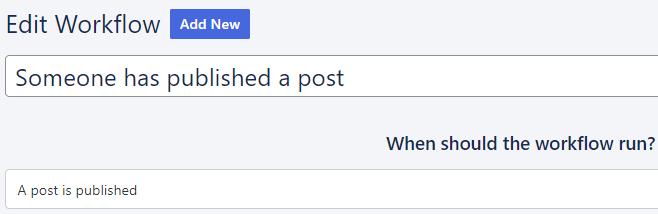

# Workflows

Workflows are your **24/7 website workforce**. Ready to **notify you** and your team whenever someone publishes, changes or comments on something. Choose what information to include, activate, and the workflow automatically gets to work. 

You could use workflows for:

- **Editorial**
    Let an editor know when a writer has submitted content
- **Social interaction**
    Alert the team when a reader has commented
- **Collaboration**
    Notify all members when changes have been made to a document 

## When you can run workflows

Workflows can be used with your **pages**, and **posts**. Send notifications whenever a:

- Post is pending review
- Post is published
- Page is published
- Post changes status
- New comment is added
- New editorial comment is made

The workflow also includes a **button** to view. 

## How to create a workflow

Click Workflows in your dashboard, and click Add new:

Let’s create a workflow that **notifies you when someone publishes a post**.

Give your workflow a **title**:

### How to set when the workflow runs

After you’ve added a title, click the dropdown under **When should the workflow run?**

### How to configure workflow notifications

You can now add a workflow **notification**:

You can add a subject line and a message. Of course, you could just type in “A post has been published”. But that might not be very helpful on its own. Particularly if lots of posts are being published. 

#### Adding dynamic tags

With dynamic tags you can **customise the notification**, to automatically include **more details**. Mix some generic text with dynamic tags that change to show the:

- Comment author
- Comment text
- Comment URL
- Post title
- Post URL

The example below shows a subject line with dynamic tags in bold. Of course, a subject line doesn’t have much space. So we’ll keep it short:

New post **%title%** from **%author%** published

The main message has more room. Let’s add the content and the URL with our own words:

Published at **%url%** and contains **%content%** 

### How to notify specific people in a workflow

Scroll down to **Who should be notified?**  

Click the dropdown to automatically notify:

- Users based on their roles
- Specific users
- All users
- Assignees
- Post authors

Add as many as you want, and click the X to remove:

You can choose to notify them:

- Via **Email**
    The email address (or addresses – you can send a group email) is taken from the [User account](user-management.md)
	
    - In **Slack**
    Add the [webhook URL](https://api.slack.com/messaging/webhooks) and channel.
    
- On the **Dashboard**
    Users see the notification when logged in

You can add multiple channels, and click **X** to remove a channel.

### How to activate a workflow

All ready? Click the **enable toggle** to activate your workflow and click **Save**:

The workflow is now running:

