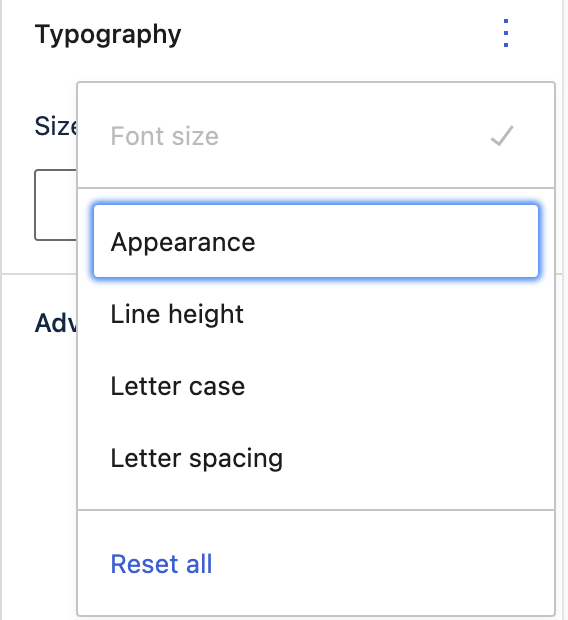
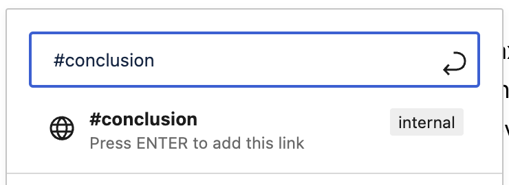

# Content Creation

Below you’ll find plenty of explanations and how-to’s for creating, publishing, and customising your content. It’s a fairly long list, but that’s because there’s so much you can do. As you’ll see below...

## How to create content using Altis

Altis gives you the familiar WordPress options of:
- **Pages**
    Choose these when you’re creating “about us” pages, service descriptions, and any page where content tends to stay the same.
- **Posts**
    Choose these when you’re creating blogs, articles, or news items. That is, content that is more regularly updated and goes out-of-date. 

Although both have different use cases, the content creation process is similar for each. 

## The Post & Block sidebar
Before we get into how to create content, we should first cover the Editor sidebar.

This relates to how you structure your content. It’s like laying the foundations of what you’re going to create. You can switch between Post and Block tabs with one click. 

The **sidebar varies** slightly depending on whether you’re creating a page or a post. 

To hide or show the sidebar, click the black **Settings cog** icon:

### Post & Block sidebar for creating Posts

As you can see below, you have plenty of dropdowns. Below we’ll go through what each one means, and how you can use them:

### Status and visibility

#### Visibility 

This gives you three options for your content:

- **Public**: The default. Use when you want to make your content instantly visible to everyone on the web.
- **Private**: Only visible to site admins and editors. Use this if you want to share content internally, such as for approval or collaborating.
- **Password Protected**: Only people with the password (set by you) can view this post. Use this for publishing content you don’t want everybody to see.

#### Publish 

Publish immediately or **schedule** a date and time. Scheduling is useful for press releases, embargoed stories, publishing outside office hours, while on holiday, or in a different time zone.

#### Stick to the top of the blog 

Tick the box next to **Make this post sticky**. This makes your post **always appear first** in the order of published blogs:

#### Pending review

As part of your organization's editorial workflow, you may be required to have posts reviewed before being published. Contributors can only save for review.

#### Select authors

Display the name of the author or authors (including [guests, multiple or external](../collaboration-and-users/guest-and-multiple-authors.md)) next to the post.

#### Move to Trash

Moves the post to the Trash. The post will stay there for 30 days by default before being deleted permanently. Unless you choose to:

- Manually delete immediately
- Restore

## Permalinks

The slug is the last part of the post’s URL. You can edit it here. Add some keywords, or shorten the URL if your title has lots of words.

## Categories

You can assign every post to a category. This is useful when you want to **organise posts by topics or themes**. Click **Add New category** to add a category:

You can create your own **categories and sub-categories**. It keeps things organised in a hierarchy for you and your audience. For example, a category could be “UK news” and the sub-category could be “Politics”. 

## Tags

Tags are **optional**. You commonly use them when you want to be more specific about your post’s content. Think of them like social media hashtags. For example:

- Category: UK news
- Sub-category: Politics
- Tag: Prime Minister

## Featured image

Add an image that is displayed **wherever** (depending on your theme) the post appears. For example, in the list of posts. Featured images differ from images you add inside the content.

## Excerpt

Add a summary (1 or 2 sentences). Something that **encourages the reader to click** and read more. Depending on your theme, the excerpt may appear next to **search results, archives**, or anywhere else the post is **previewed**. 

## Discussion

Tick **Allow comments** to allow people to comment on the post.

Tick **Allow pingbacks & trackbacks** to allow other blogs that link to your post to appear in your comments section. Part of their post may then be displayed or linked to in the comments section. This is usually deactivated by default, to avoid automated spam links appearing.

## Attributes

Click to change your content’s **layout**. 

If your theme provides additional templates, they will show here alongside the standard “**Default template**”.

Themes may provide templates like: 
- **Cover template**: display the title of the post or page on top of the featured image
- **Full width template**: removes sidebars so the reader can focus more on the content

#### Featured image

Add an image that is displayed **wherever** the page appears. This depends on your theme, so for example, it could appear in headers, search results, or when shared on social media.

#### Discussion

Tick **Allow comments** to allow people to leave a comment. These are usually deactivated by default.

### Page attributes

Click to change your content’s **layout**. 

Any **templates** provided by your theme will show here, alongside the standard options of:
- **Default template**: use when you want to match the template to your site theme
- **Cover template**: display the title of the post or page on top of the featured image
- **Full width template**: removes sidebars so the reader can focus more on the content

You can also give the page a **parent**. Use this to introduce a hierarchy to your content, keeping things organised and categorised. For example, if the page is selling trousers, its parent page might be “clothes”.

Click **Order** to rearrange the order of the pages displayed. This depends on your theme settings. For example, you might have three pages appearing in a row of three boxes. Assign the three pages with a number of 1,2,3 to define the order they appear. 

For people reading left-to-right, you could use this when you want to show a 3-step process, with Step 1 appearing on the left, Step 2 in the middle, Step 3 on the right.

## How to create content: Posts & Pages 

Posts and Pages are found underneath your dashboard. 

Click **Pages** to view currently published pages, and click **Add New** to… well, add a new page:

It’s the same for Posts:

### Title

Add a title for the content. This is the main headline to grab your reader’s attention. It’s also for search engines to understand the content and display in search results.

### Write or add block

You can either click and start typing underneath the title, or click the + to add a block:

As you start typing, a **toolbar** appears above your text:

### Toolbar

These icons mean (left-to-right):

- Change the **style** or block **type**
- Change text **alignment** (aligned left, centre, right)
- Make text **bold**
- Make text **italic**
- **Hyperlink** text
- Click the dropdown for options to:
	- Add **inline code**
	- Add **inline images**
	- Open **keyboard input** (for special characters)
	- Add **strike-through** text
	- Make text **subscript**
	- Make text **superscript**
	- Edit text **color**
- **Click the overflow menu (three dots) for extra block options**:
	- **Copy** block
	- **Duplicate** block
	- **Insert** a new block **before** the block
	- **Insert** a new block **after** the block
	- **Move** block to another section
	- Edit block as **html**
	- **Add** block to [Reusable blocks](reusable-blocks.md)
	- **Group** block
	- **Remove** block

### How to use the Block tab: Posts & Pages

Here’s a more detailed guide to [creating blocks](creating-content-with-blocks.md) if you prefer. Below is just an **overview**, to show you how blocks work with content creation.

#### How to add a block

Click the **+ sign**:

You’ll see a selection of common blocks to use:

Choose one of these, or click **Browse all** to open up the full selection.

For this example, we’ll choose a Paragraph:

The paragraph block allows you to easily craft content and is the default block type for text added to the editor. It’s probably the block you will use most.

You can write your content like a regular document and each paragraph will automatically be turned into a block behind the scenes.

You can also choose the paragraph block from the “Block Inserter” (+) pop-up window when you click on the (+) sign.

[https://wordpress.org/support/files/2019/03/paragraph.mp4](https://wordpress.org/support/files/2019/03/paragraph.mp4) 

Now, on the sidebar, the Block tab shows options for editing the block:

##### Typography

Click to adjust the **font size**. Your theme will include a set of standard sizes. You may also see options to choose:

- Default = matches your theme’s default font
- Custom = click the **set custom size icon** to add your own custom size font

Clicking the **View Options** (three dots) menu allows you to control
- Appearance,
- Line Height,
- Letter Case,
- Letter spacing, and
- Reset All

To start over, click **Reset All**

##### Colour settings

You can **change** the colour of the **text** and the text **background**. 
Click on a circle to choose a colour. There may be a set of colurs provided by the theme as well as a default set.
Click on the chequered area to pick a custom color or add a **hex code**.

##### Anchor links/page jumps

If your post has multiple headings, you can use **HTML anchors**. Also known as **in-page jumps**. Your users’ thumbs will thank you for these. 

These are clickable hyperlinks that jump to headings on the same page. Users (and their thumbs) can then spend less time scrolling to find what they need. 

For example, imagine you’re publishing an in-depth **product review**. You’ll want to include multiple sections, such as “ease of use”, “build quality”, “value for money”, “conclusion”. People can then click on the heading and go straight to the section. Here’s how to make it happen with anchor links:

1.  Create a Heading block:
	
2. The block appears for you to write the heading:
      
3.  We’ll give the heading a name of **Conclusion**
4.  Click **Advanced**, and type in the HTML anchor ID. A word or two, without spaces, is fine:
	

5.  Now, it’s time to create the anchor link. When someone clicks on the anchor link, they’ll **jump** to the Conclusion heading.  
6.  Highlight the text that will be clickable:
	
7.  Click the **insert/edit link** icon
8.  Add the anchor link name, making sure to put **#** at the start. Press Enter:
	 
9.  Now, whenever someone clicks Conclusion, the page jumps to the Conclusion heading:
	

You also have the option to add a **CSS** class:

## How to publish content

After you’ve created your content, you can either click to:

- **Save draft**
    Save your work without publishing it. The content appears when you click **All Posts** or **All Pages**, for you to continue working on it:
    
- **Preview**
    See how your content will look on **desktop**, **mobile** or **tablet**
    
- **Publish**
- Click to publish your content immediately. This opens up the visibility settings and options to change the publish date and time of
publication.

  

- **Settings**

    

    Click the Settings icon to open the Post & Block sidebar 

## After you’ve published content

Congratulations! Your content is out there, ready to go viral, inspire and convert your audience, and whatever else you want it to do.

You can now:
- View the content
- Copy its link

### How to unpublish content

Go back to the content and click **Switch to draft**:

Just remember that anyone trying to view the page will get a 404. So this might not be the best option if the page URL has already been shared. For example, on social media, as part of a campaign, or in an email. 

A negative experience could annoy your users, and can also affect your SEO. Consider redirecting the URL to another page before unpublishing.

#### How to redirect a URL

Click **Redirects**:

Click **Add new**:

### How to edit published content

Open the content, make your edits and then **click Update**:

