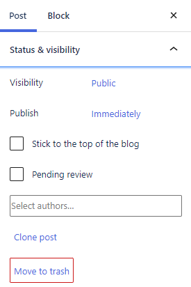
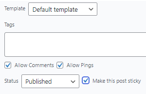
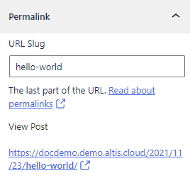
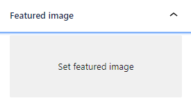
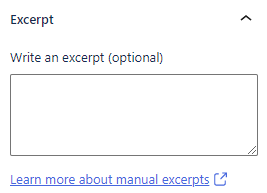
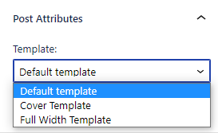
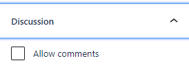

---
title:
order: 0
---

# Content Creation

Below you’ll find plenty of explanations and how-to’s for creating, publishing, and customising your content. It’s a fairly long list, but that’s because there’s so much you can do. As you’ll see below...

## How to create content using Altis

Altis gives you the familiar WordPress options of:
- **Pages**
    Choose these when you’re creating “about us” pages, service descriptions, and any page where content tends to stay the same.
- **Posts**
    Choose these when you’re creating blogs, articles, or news items. That is, content that is more regularly updated and goes out-of-date. 

Although both have different use cases, the content creation process is similar for each. 

## The Post & Block sidebar
Before we get into how to create content, we should first cover the Editor sidebar.

This relates to how you structure your content. It’s like laying the foundations of what you’re going to create. You can switch between Post and Block tabs with one click. 

The sidebar varies slightly depending on whether you’re creating a page or a post. 

To hide or show the sidebar, click the black Settings cog icon:

### Post & Block sidebar for creating Posts

As you can see below, you have plenty of dropdowns. Below we’ll go through what each one means, and how you can use them:

### Status and visibility

#### Visibility 

This gives you three options for your content:

- **Public**: The default. Use when you want to make your content instantly visible to everyone on the web.
- **Private**: Only visible to site admins and editors. Use this if you want to share content internally, such as for approval or collaborating.
- **Password Protected**: Only people with the password (set by you) can view this post. Use this for publishing content you don’t want everybody to see.

#### Publish 

Publish immediately or schedule a date and time. Scheduling is useful for press releases, embargoed stories, publishing outside office hours, while on holiday, or in a different time zone.

#### Stick to the top of the blog 

Tick the box next to Make this post sticky. This makes your post always appear first in the order of published blogs:

#### Pending review

As part of a workflow ([see workflows documentation](../collaboration-and-users/workflows.md)), you may be required to have posts reviewed before being published. Contributors can only save for review.

#### Select authors

Display the name of the author or authors (including [guests, multiple or external](../collaboration-and-users/guest-and-multiple-authors.md)) next to the post.

#### Clone post

Make an unpublished copy of the post. Useful for creating new posts without starting from scratch.

##### Create amendment

Click this to work on a duplicate version. Make your edits. Then, after approval or review, click Publish Amendment to replace the current version:

#### Move to Trash

Moves the post to the Trash. The post will stay there for 30 days by default before being deleted permanently. Unless you choose to:

- Manually delete immediately
- Clone
- Restore

## Yoast SEO

This is the powerful all-in-one SEO plugin built for WordPress. 

### Readability analysis

Yoast scans your text to see if it’s easy to read and gives you feedback. Its algorithm checks things like whether you’re using complicated words, long sentences, active vs passive voice. It then gives you a rating and recommendations for improvement. Kind of like a helpful assistant.

For the full analysis, click the Readability tab under your post:

Want to give your post a better chance of being found and ranked by search engines? Click Improve your post with Yoast SEO:

Enter a word or phrase you want the post to be found for in search engines:

Click the ? icon for advice on this. Then click Get related keyphrases. You may be asked to login or register with Semrush. Click Approve: 

This gives you lots of keyphrases you can add to your content. 

## Permalinks

The slug is the last part of the post’s URL. You can edit it here. Add some keywords, or shorten the URL if your title has lots of words.

## Categories

You can assign every post to a category. This is useful when you want to organise posts by topics or themes. Click Add New category to add a category:

You can create your own categories and sub-categories. It keeps things organised in a hierarchy for you and your audience. For example, a category could be “UK news” and the sub-category could be “Politics”. 

## Tags

Tags are optional. You commonly use them when you want to be more specific about your post’s content. Think of them like social media hashtags. For example:

- Category: UK news
- Sub-category: Politics
- Tag: Prime Minister

## Featured image

Add an image that is displayed wherever (depending on your theme) the post appears. For example, in the list of posts. Featured images differ from images you add inside the content.

## Excerpt

Add a summary (1 or 2 sentences). Something that encourages the reader to click and read more. Depending on your theme, the excerpt may appear next to search results, archives, or anywhere else the post is previewed. 

## Discussion

Tick "Allow comments" to allow people to comment on the post.

Tick "Allow pingbacks & trackbacks" to allow other blogs that link to your post to appear in your comments section. Part of their post may then be displayed or linked to in the comments section. This is usually deactivated by default, to avoid automated spam links appearing.

## Attributes

Click to change your content’s layout. 

If your theme provides additional templates, they will show here alongside the standard “Default template”.

Themes may provide templates like: 
- Cover template: display the title of the post or page on top of the featured image
- Full width template: removes sidebars so the reader can focus more on the content

#### Featured image

Add an image that is displayed wherever the page appears. This depends on your theme, so for example it could appear in headers, search results, or when shared on social media.

#### Discussion

Tick "Allow comments" to allow people to leave a comment. These are usually deactivated by default.

---

# ML Got to here. More to do
---

### Page attributes

Click to change your content’s layout. 

Any templates provided by your theme will show here, alongside the standard options of:

- Default template: use when you want to match the template to your site theme
- Cover template: display the title of the post or page on top of the featured image
- Full width template: removes sidebars so the reader can focus more on the content

You can also give the page a parent. Use this to introduce a hierarchy to your content, keeping things organised and categorised. For example, if the page is selling trousers, its parent page might be “clothes”.

Click Order to rearrange the order of the pages displayed. This depends on your theme settings. For example, you might have three pages appearing in a row of three boxes. Assign the three pages with a number of 0,1,2 to define the order they appear. 

For people reading left-to-right, you could use this when you want to show a 3-step process, with Step 1 appearing on the left, Step 2 in the middle, Step 3 on the right.

## How to create content: Posts & Pages 

Posts and Pages are found underneath your dashboard. 

Click Pages to view currently published pages, and click Add New to… well, add a new page:

It’s the same for Posts:

### Title

Add a title for the content. This is the main headline to grab your reader’s attention. It’s also for search engines to understand the content and display in search results.

### Write or add block

You can either click and start typing underneath the title, or click the + to add a block:

As you start typing, a toolbar appears above your text:

### Toolbar

These icons mean (left-to-right):

- Change the style or block type
- Change text alignment (aligned left, centre, right)
- Make text bold
- Make text italic
- Hyperlink text
- Click the dropdown for options to:
	- Add inline code
	- Add inline images
	- Open keyboard input (for special characters)
	- Add strikethrough text
	- Make text subscript
	- Make text superscript
	- Edit text colour
- Click the three dots for extra block options:
	- Copy block
	- Duplicate block
	- Insert a new block before the block
	- Insert a new block after the block
	- Move block to another section
	- Edit block as html
	- Add block to Reusable blocks [link: Reusable blocks]
	- Group block
	- Remove block

### How to use the Block tab: Posts & Pages

Here’s a more detailed guide to creating blocks [link: Creating content with blocks] if you prefer. Below is just an overview, to show you how blocks work with content creation.

#### How to add a block

Click the + sign:

You’ll see a selection of common blocks to use:

 Choose one of these, or click Browse all to open up the full selection.

For this example, we’ll choose a Paragraph:

The paragraph block allows you to easily craft content and is the default block type for text added to the editor. It’s probably the block you will use most.

You can write your content like a regular document and each paragraph will automatically be turned into a block behind the scenes.

You can also choose the paragraph block from the “Block Inserter” (+) pop-up window when you click on the (+) sign.

[https://wordpress.org/support/files/2019/03/paragraph.mp4](https://wordpress.org/support/files/2019/03/paragraph.mp4) 

Now, on the sidebar, the Block tab shows options for editing the block:

##### Typography

Click to adjust the font size. Your theme will include a set of standard sizes. You may also see options to choose:

- Default = matches your theme’s default font
- Custom = add your own custom size font

To start over, click Reset:

 

##### Colour settings

You can change the colour of the text and the text background. 

Click on a circle to choose a colour. Or click Custom colour for a colour picker, where you can also add a HEX code:

##### Text settings

This gives you a Drop cap toggle button. Click to increase the size of the first letter of the first sentence. 

##### Anchor links/page jumps

If your post has multiple headings, you can use HTML anchors. Also known as page jumps. Your users’ thumbs will thank you for these. 

These are clickable hyperlinks that jump to headings on the same page. Users (and their thumbs) can then spend less time scrolling to find what they need. 

For example, imagine you’re publishing an in-depth product review. You’ll want to include multiple sections, such as “ease of use”, “build quality”, “value for money”, “conclusion”. People can then click on the heading and go straight to the section. Here’s how to make it happen with anchor links:

1.  Create a Heading block:
    
2.  The block appears for you to write the heading:
    
3.  We’ll give the heading a name of Conclusion
4.  Click Advanced, and give the HTML anchor a name. A word or two, without spaces, is fine:
    
5.  Now, it’s time to create the anchor link. When someone clicks on the anchor link, they’ll jump to the Conclusion heading.  
6.  Highlight the text that will be clickable:
    
7.  Click the insert/edit link icon
8.  Add the anchor link name, making sure to put # at the start. Press Enter:
    
9.  Now, whenever someone clicks Conclusion, the page jumps to the Conclusion heading:
    

You also have the option to add CSS:

## How to publish content

After you’ve created your content, you can either click to:

- Save draft
    Save your work without publishing it. The content appears when you click All Posts or All Pages, for you to continue working on it:
    
- Preview
    See how your content will look on desktop, mobile or tablet
    
- Publish
    Click to publish your content immediately. This opens up the publication checklist, visibility settings, options to change the publish date and time of publication, and Yoast analysis
    
- Settings
    
    Click the Settings icon to open the Post & Block sidebar 
- Publication checklist
    
    Click the tick icon to open the Publication Checklist. This shows recommended tasks to complete before publication.

    Your development team may change the publishing checklist to match your specific in-house requirements. You can also click the Skip checks toggle button to publish without completing the checklist:

    

## After you’ve published content

Congratulations! Your content is out there, ready to go viral, inspire and convert your audience, and whatever else you want it to do.

You can now:

- View the content
- Copy its link
- spread the word on social media (if you’ve set these up in Yoast)

### How to unpublish content

Go back to the content and click Switch to draft:

Just bear in mind that anyone trying to view the page will get a 404. So this might not be the best option if the page URL has already been shared. For example, on social media, as part of a campaign, or in an email. 

A negative experience could annoy your users, and can also affect your SEO. Consider redirecting the URL to another page before unpublishing.

#### How to redirect a URL

Click Redirects:

Click Add new:

### How to edit published content

Open the content, make your edits and then click Update:

### How to clone published content

## How (and when) to amend content

An amendment is similar to a clone, because it creates a copy of an already published post or page. Multiple people can collaborate on the amendment. Then when it’s ready, click Publish Amendment and it replaces the original.

Hover over the page or post to be amended and click Create Amendment:

You can now make edits, save drafts, and preview. Just like you would normally in WordPress. The only difference is a reminder message to tell you that you’re editing an Amendment:

For anybody else collaborating, they can see the Amendment in the dashboard:

 

When you’re ready, click Publish Amendment:

This gives you two options:

- Save changes and compare
    Choose this and you can view changes between the original and the amended versions before publishing
- Publish Amendment
    Choose this and the amendment goes live straightaway. Although maybe you want to delay when the amendment goes live? That’s when you can schedule amendments (see below for how)

### Scheduling amendments

An amendment is great when you want to plan your edits in advance. Maybe you want to schedule a page changing from:

- “New product coming soon” to “New product now available”
- “Sale finishes at midnight” to “Sale now closed”
- “The winner will be announced here at 2pm…” to “The winner is…”

Or maybe you want changes to happen while you are:

- In a meeting
- On leave or away from the office
- Lacking reliable Wi-Fi 

In the sidebar, click the date and time next to Publish Amendment:

This opens a calendar. You can now set when the amendment goes live, down to the very minute:

