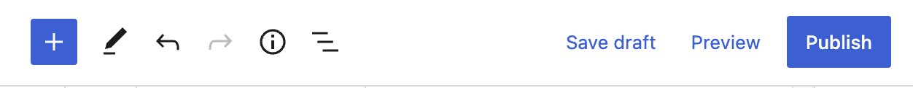
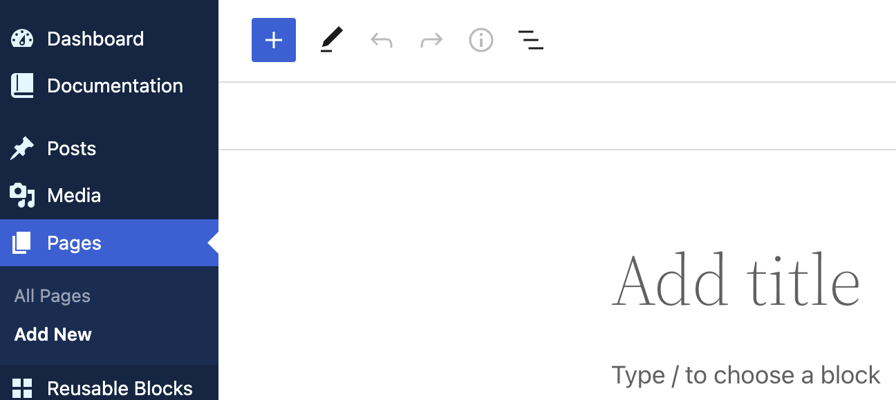
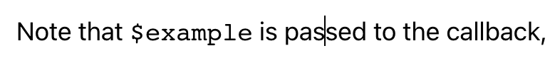

---
title:
order: 0
---

# Creating content in Altis with blocks

## What are blocks?

Blocks are the **components for adding content** in Altis. Each block can contain a distinct part of the content on your page. A block can be a paragraph of text, images, videos galleries, plus lots more. You can **drag** and **rearrange** blocks, and be as flexible as you need to be with your layouts. 

Your readers won’t see the blocks–they just see your beautiful content. Check out this [list of common blocks](https://wordpress.org/support/category/common-blocks/) you can use.

## Block sidebar

The block sidebar where you can edit the Block’s **settings**.

Click the block you want to edit. If you don’t click on the block first, you’ll see this:

As you can see, the paragraph block offers text settings, colour settings, and **advanced options**.

### Text settings

Here’s where you can change the paragraph’s **font size**, either with relative percentages or exact pixels. 

### Colour settings

You can set text and background colours on a per-block basis, enabling you to **call attention** to important content.

By clicking on the chequered area, you can **choose specific colours**. You can click the hue in the big box or move the sliders:

 You can also click the slider icon to choose Hexadecimal, RGB, or HSL:

**Accessibility checks** are also built into the new editor. You’ll get a warning if any text colour combinations could cause problems for people with reading impairments.

Advanced

Click the advanced tab to add a custom CSS class. It can then pick up styles for your block from [custom CSS](https://wordpress.com/support/editing-css/) you create:

## Top menu

At the top of your page, you’ll find a menu. Below is what you can do with each icon:

- Click the **+ icon** to add a block
- Click to switch between **editing** mode (the tick or check mark is next to the **pen** icon) or **selection** mode (tick is next to **Select**)
	
- Click **Undo** to **cancel** your previous action
- Click **Redo** to undo the undo of your previous action
- Click **Details** to view a **summary** of the content on your page:

- Click the **List view** icon to view the block types you have on the page,
    

## How to add a block
- **At the top of the page**
    Click the **blue +**:
    
- **Within blocks**
    Hover over a block and click the **+ sign**:
	

### How to choose a block type

A pop-up appears with your six most-recently used blocks. If you don’t see the block you want, either use the search bar or click **Browse all**:

Hover over a block name for an explanation and a preview:

Click your chosen block, and it appears on your page:

### How to change block style or style

Click on the block icon and you can see different options for changing the type of your block. Maybe from a list to a paragraph. Hover over an option to see a **preview** ( the image below is previewing a Pullquote)

### How to rearrange the order of a block

You can either click the arrows to move a block **up** or **down**. Useful for when you just want to quickly rearrange the order:

Or you can click the **drag icon**. Useful when you want to move a block quickly across several blocks:

## How to edit content in a block

### How to align text in a block

Click the **align icon** to align everything inside the block, left, centre or right:

### How to make text bold

Highlight some text and then click the **bold icon** (or use CMD+B/CTRL+B):

### How to make text italic

Highlight some text and then click the **italic icon** (or CMD+I/CTRL+I):

### How to add hyperlinks

Highlight the text and then click the **hyperlink icon** (or CMD+K/CTRL+K):

Start typing the page name or enter the URL (make sure to include https://):

You then have three hyperlinking options:

Toggle to:
- **Open in new tab**
    Toggle this when you want the clicked page to open in a new tab. Normally this is bad practice (because users can’t click the back button in the new tab), However, it can be useful when hyperlinking to a pdf document, online tool, or somewhere else that isn’t another website page. 
- **Tell search engines to ignore the link**
    Toggle this when you don’t want search engines crawling the hyperlink and boosting the link’s SEO ranking. Maybe because you’re linking as part of a sponsored deal, or it’s a page you don’t trust.
- **Tell search engines this is a sponsored link or advert**
    Toggle when you want search engines to know the hyperlink is paid for or incentivised.

### How to insert images and format text into a block

Click the **dropdown icon** to view more text editing options:

- Highlight
	Highlight the selected text with a different text or background color
	
- **Inline code**
    Make selected text appear like a computer code snippet. Often in a fixed pitch font (each character occupies the same amount of space. The word "$example" below:

- **Inline image**
    Place an image within the text.
- **Keyboard input**
    Make selected text look like a keyboard command:

- **Strikethrough**
	Puts a horizontal line through the middle of selected text.
- **Subscript**
	Reduce the selected text size and put it below the normal line of type.
- **Superscript**
	Reduce the selected text size and put it above the normal line of type.
- T**ext Color**
	Change the selected text color. Either select the color from a palette or enter the HEX code.

#### Example: Formatting inline code

1.  Highlight the **text** you want to **edit**. For this example, we’ll turn "$example" into **inline code**:
	
2.  Click the **Options** dropdown and click **Inline code**:
	
1.  That’s it!
	
4.  To remove the inline code, just open the dropdown again. The black box shows that Inline code is selected:
	
1.  Simply click again to **remove**

### More options for editing blocks

Click the Options icon:

#### How to copy a block

Click **Options > Copy** to copy all the content inside a block. You can then paste it inside another block.

#### How to duplicate a block

Click **Options > Duplicate** to copy a block and its content. This appears after the original block.

#### How to insert a new block above a block

Click **Options > Insert before** to add a block **above** the block you selected. Click the **+** to choose the type of block:

#### How to insert a new block below a block

Click **Options > Insert after** to add a block **below** the block you selected. Click the **+** to choose the type of block

#### How to move an existing block to another part of the content

Click **Options > Move to** to specify where to move a block. You get a blue separator line inside your content, and can then use arrow keys to move that line up and down to where you want the selected content moved to:

Press **Return/Enter** on your keyboard to move the block to that position.

#### How to edit a block’s html

Want to edit the html that makes up a block? Click Options > Edit as html to open the html editor. You can view the block’s existing html and add your own, such as inline CSS or span tags. Be careful–these sorts of changes can make a block invalid.

To **exit** the html editor, click  **block > Options > Edit visually**:

#### How to reuse a block you created

Maybe you find yourself often creating a layout with the same blocks. For example, a page with blocks for:
- Heading  
- Image
- Paragraph
- Quote

You can save this as a template that can be reused. View [Reusable blocks](reusable-blocks.md) to see how.

#### How to edit multiple blocks of the same type

Want to make the same edit to multiple blocks of the same type? No problem. 

1.  Switch to **select mode** by clicking the mode icon at the top:
	
2.  Hold **Shift** and click the blocks you want to edit (you can also click and **drag** to highlight the blocks):

As you select multiple blocks, the **Block sidebar** keeps track for you:

You can now make edits in the sidebar which will apply to all selected blocks. The image below shows the blocks after modifying the font size and letter spacing:

Depending on the blocks you select, you may also be able to **transform** the blocks into a different type. Select the **block icon** on the left of the block toolbar (here it is a pragraph icon).

For example, multiple paragraphs transformed into a bulleted list:

#### How to delete a block

Click the block you want to delete. Then click **Options > Remove block** where "block" will be the type of the block.

