---
title:
order: 30
---

# Reusable Blocks

Ever found yourself creating the same content block **over and over**? All that repetition wastes time, is inefficient, and can lead to mistakes. It’s also totally unnecessary. That’s because you can create Reusable Blocks instead. Create a block once, then reuse across **posts**, **pages**–even different **websites**. 

You’ll save loads of time. For example, imagine all your blog posts end with a “contact us” block. You include an email address, phone number, maybe an office location. If any of those details change, simply edit the Reusable Block once. Rather than editing all your posts one by one. 

## How to create a Reusable Block

This option is for when you’re in the page or post editor. 

Choose or create the [block](creating-content-with-blocks.md) you want to make reusable. 

Click the **three dots > Add to Reusable Blocks**:
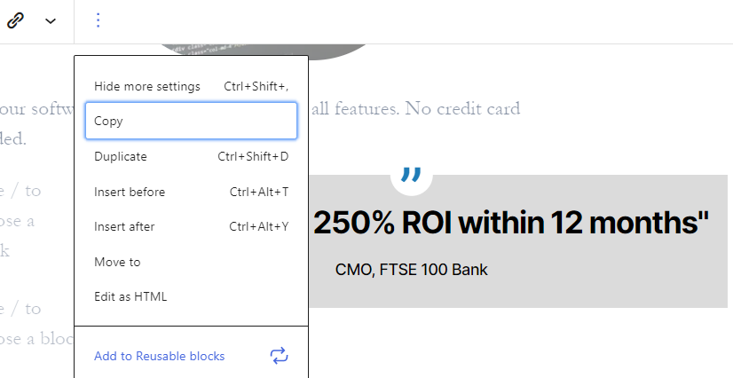

This opens a dialogue box for you to enter a name. Give the Reusable Block a descriptive name for you and/or your team:
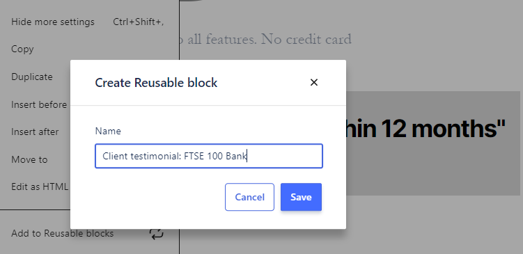

Click **Save**. The name now appears above your newly created Reusable Block:
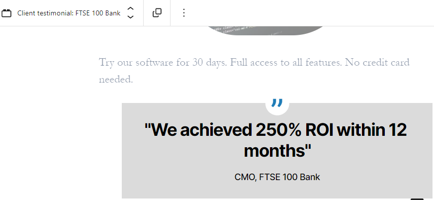

The next time you add a block, the Reusable block will appear in your search results:
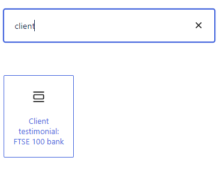

## How to add a Reusable Block to your page/post

Adding a Reusable Block works the same way as adding any other block. Click the + sign to view the options:
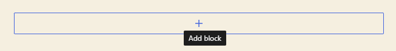

You can either enter the Reusable Block’s name into the search bar:
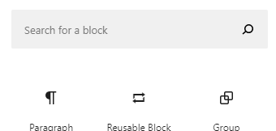

Or you can click **Reusable Block** and then click on your preferred block:
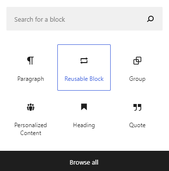

### A shortcut to adding a Reusable Block

You can search for a reusable block by name just like other blocks.

Enter / and then your Reusable Block’s name. For example: **/contact us**. As you type after **/**, Altis will start suggesting blocks for you:
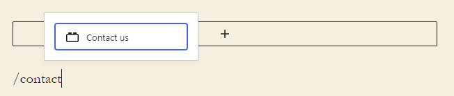

## How to edit a Reusable Block

The changes you make will show wherever you’re using the Reusable Block. However, sometimes you might only want to **edit the Reusable Block on one page or post**. 

That’s when you can **Convert** to regular blocks.  

### How to convert a Reusable Block to a regular block

Select the Reusable Block you want to convert. Then click the Convert icon:
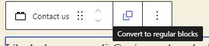

## How to group Reusable Blocks

A Reusable Block can also be a group of blocks. For example, imagine you want to create a **template** for journalists to use when publishing news articles. In the example below, you’ve created four blocks:

1. Heading
2. Introduction
3. Image
4. Article

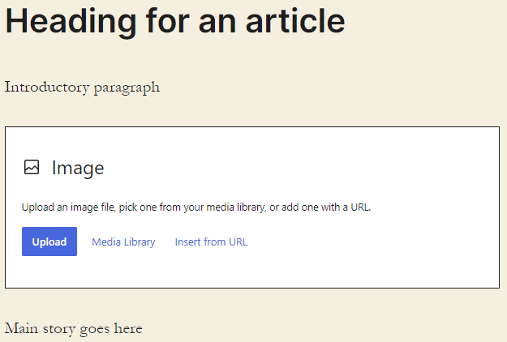

Select the four blocks at once. You can click and drag to highlight, or hold Shift + click:
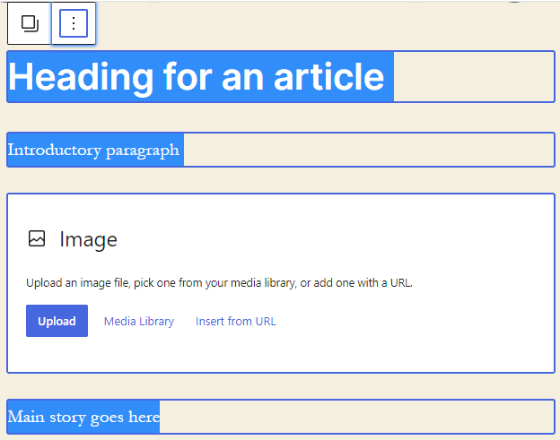

Click **Options** (three dots) when it appears at the top of your first highlighted block. Then click **Add to Reusable Blocks**:
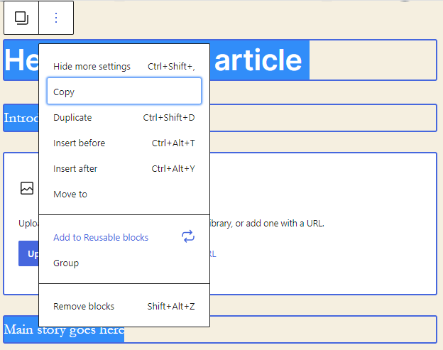

## How to export/import Reusable Blocks

Reusable Blocks are happy to travel – you can take them anywhere. **Insert** into pages and posts, **import** and **export** across different WordPress websites. You can also **download** them as backups. 

### How to export Reusable Blocks

Head to your list of Reusable Blocks:
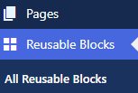

Hover over the Reusable Block you want to export, and click **Export as JSON**. JSON (JavaScript Objection Notation) is a common way to transport data, nice and easy.
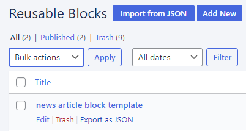

This automatically downloads to your device.

### How to import Reusable Blocks

Open **Reusable Blocks** in your dashboard:

Click **Import from JSON**:
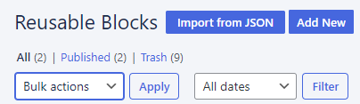

Choose the file and click **Import**:
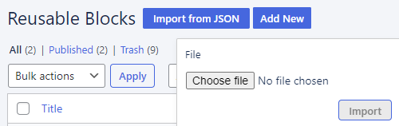

### How to manage duplicate Reusable Block names

Here’s one thing to remember. If you **already have a Reusable Block with the same name** in your list, you’ll end up with two blocks with the same name. It will not overwrite the previous one:
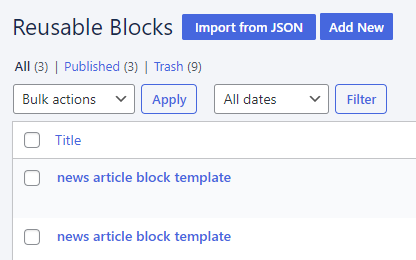
To avoid any “Er, which Reusable Block is the right one?” headaches, just **edit the name** after importing. Check under **Date** to see which one you just imported. 
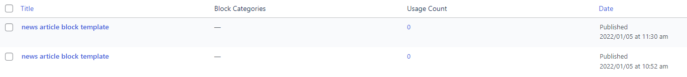

Then **hover** and click **Edit** on the Reusable Block:
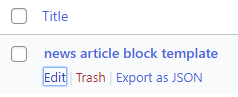

## How to add a block category

With this option, you can add more details to your categories:

Click **Reusable Blocks > Categories**:
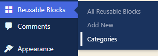

You’ll see the option to add a new category:
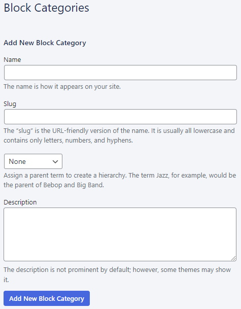

- **Name**
    Try to keep this as short as possible. Ideally, a descriptive word or phrase that tells people what the category is about.
- **Slug**
    This is not used.
- **Parent**
    You can create your categories in a hierarchy and choose a parent category here. For example, categories of Football and Tennis could have Sport as a category parent.
- **Description**
    This does not appear anywhere on the site and is only for your reference.

### Editing a Reusable Block category

Click **Reusable Blocks > Categories**:
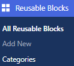

You’ll see the list of categories, **Bulk edit** options, plus a **Search bar** at the top. The **Count** column shows how often the category is being used:
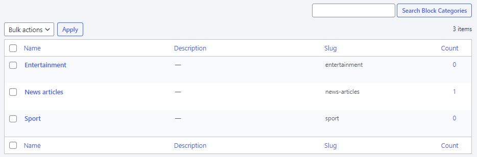

**Hover** over the category you want to edit:
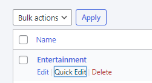

You’ll see two editing options:

- **Quick edit**
    Edit the category name and slug
- **Edit**
    Edit the category name, slug, parent and description

### Deleting a Reusable Block category

Hover over the category and click **Delete > OK**:
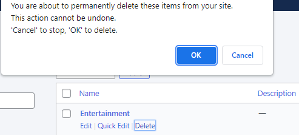

To **delete more than one Reusable Block**, click the square at the top to select all categories, Deselect any you want to keep, and choose **Delete** from the Bulk action dropdown:
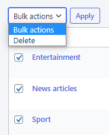

## How to see where your Reusable Blocks are being used

When you edit a reusable Block, the edit screen shows everywhere the Reusable Block is used.

Open the Reusable Block, and click the **Relationships** icon:
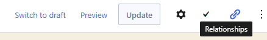
