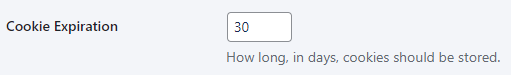

# Privacy & consent

Website owners usually have national or international privacy laws to follow. This can mean explaining to users what you do with any
data collected, and showing how you comply with GDPR, CCPA, and relevant directives and regulations. Alongside giving users the
option to give or refuse consent. For all this, you need online privacy policies and consent functions.

Without these, there’s a risk of fines and/or legal action, plus potential loss of consumer trust. Particularly if you’re collecting
Personally Identifiable Information (PII) during interactions and transactions.

WordPress also needs to know which website page is your privacy policy. That’s because privacy policies are automatically made
available in specific places. These depend on your theme, but may include a hyperlink to the privacy policy on login or checkout
pages.

## How to add a privacy policy

In your dashboard hover over **Settings** and click **Privacy**:

**Do you already have a privacy policy page?** Click the dropdown next to **Select a Privacy Policy** and select the page:

**Not yet created a privacy policy?** Altis will help you create one.

### How to create a privacy policy

Click the **Create Privacy Policy Page** button.

This opens a **template** with multiple blocks. These are dynamic, so any plugins or custom code may mean additional sections appear
as suggestions. Read these to see whether they should be added to your privacy policy.

The headings include **topics** that a privacy policy often covers. The paragraphs include some **ideas** for what to include. Of
course, site administrators can **rearrange, edit and delete** these.

Make your changes and click **Publish** when you’re done. The Privacy Policy is now stored among your pages.

## How to ask for cookie consent

Anyone who’s ever been online has stumbled across a cookie consent banner. Where you can accept, limit, or reject cookies and other
trackers. Under the General Data Protection Regulation (**GDPR**), which protects EU citizens and residents, website owners risk *
*large fines** if they don’t display one.

**We don’t want that to happen to you**. That’s why we added some cookie-related features to help you. These include features for
banners, consent and storage.

### How to configure a cookie banner

Click the dropdown to choose whether to **display a cookie consent banner**:

### Choose how long to store cookies

By default cookies are stored for **30 days**. 
If you want to change the number of days, click the white box and add the number:

### How to edit cookie banner options

You have two options for what to show on the banner:

- **Allow/Deny all cookies**
  The simplest option. Visitors click once to make their choice.
- **All cookie categories**
  Visitors can choose which types of cookies to allow or deny.

### How to edit the cookie banner message

You can edit the text directly. The toolbar has a few CMS editing features you’ll probably recognise:

### How to create a cookie policy page

You can either choose an existing cookie policy page to link to. One you’ve already created in your Pages. Or you can click **Create
Cookie Policy Page**:

This opens up a **template**. Just like the Privacy Policy template, you’ll see editable headlines and paragraph blocks which vary
depending on your plugins and any customisation. These are just to guide you and give you ideas for what to include:

<!-- markdownlint-disable-file MD025 -->
