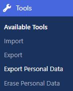
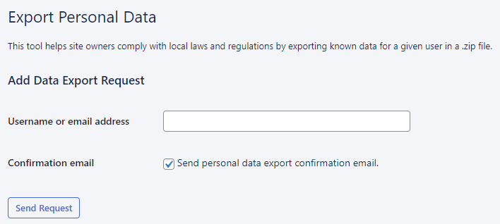
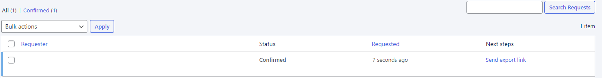
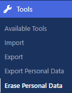
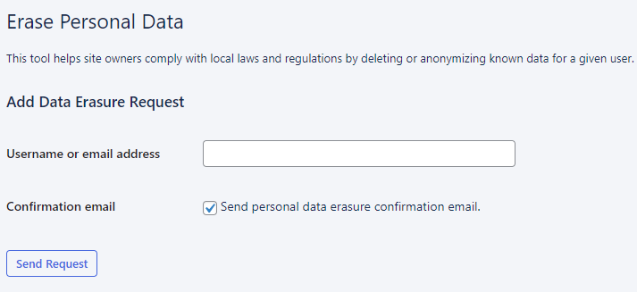
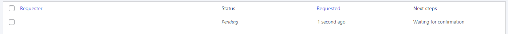

# Data export and erasure

Alongside [privacy and consent](README.md), **data protection** is another area where website owners have to comply.

In Europe, this mainly means the **General Data Protection Regulation (GDPR)**. Where people have the right to ask for, and request
deletion of, any data you hold about them. For any requests, you get **30 days** to respond.

With Altis you can export and delete **in just a few clicks**.

## How to export personal data

This is when someone wants to see **what personal data** you have for them.

Go to your **dashboard**, click **Tools** and **Export Personal Data**:

Add the person’s username or email address. Tick if you want them to receive a confirmation email. This email asks the person to
confirm their email address is correct, and to click a link to confirm they want their data exported.

Then click the **Send Request button**:

Scroll down and you can track the **progress** of all exports:

For each column:

- **Requester** is the person whose data is being exported
- **Status** is whether the request has been granted. If you’ve requested the person to confirm their export, the status shows as *
  *Pending**. Otherwise it says **Confirmed**
- **Requested** shows when the request was made
- **Next steps** shows a link for the person to download their data (when the status is confirmed)

## How to erase personal data

Under the UK GDPR, individuals have the right to have personal data erased. However,
the [Information Commissioner’s Office (ICO) guidelines](https://ico.org.uk/for-organisations/guide-to-data-protection/guide-to-the-general-data-protection-regulation-gdpr/individual-rights/right-to-erasure/)
say this “Right To Erasure” is “not absolute and only applies in certain circumstances.” That’s why we recommend checking with the
ICO whenever you receive a request to erase data. For example, the individual may be a customer or subscriber. In these cases, you
could have a lawful basis for not erasing their data.

Assuming you do wish to erase personal data, head to your **dashboard**. Click **Tools** and **Erase Personal Data**:

Add the person’s username or email address. Tick if you want them to receive a confirmation email. This email asks the person to
confirm their email address is correct, and to click a link to confirm they want their data erased. Then click the **Send Request
button**:

Scroll down and you can track the progress of all erasure requests:

For each column:

- **Requester** is the person whose data is being erased
- **Status** is whether the request has been granted. If you’ve requested the person to confirm the erasure via email, the status
  shows as **Pending**. Otherwise it says **Confirmed**
- **Requested** shows when the request was made
- **Next steps** shows whether the person has confirmed the request to erase their data (if you asked for email confirmation). When
  the status is confirmed, you get a link for you to click and erase their data
