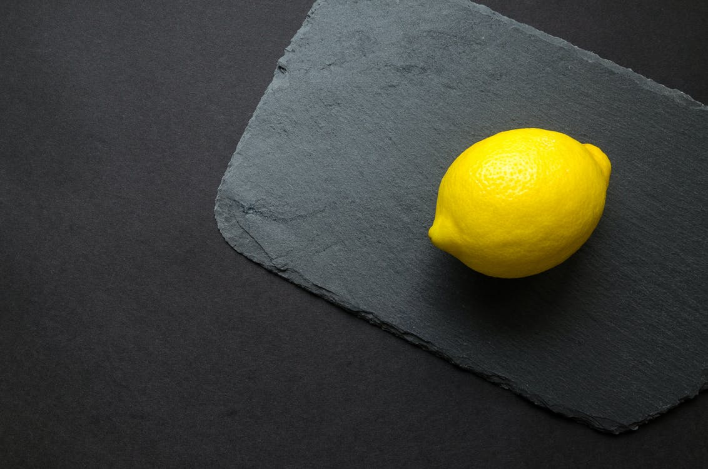
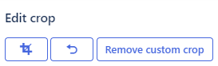

# Editing images

Want to edit an image after it's been uploaded to your website? No problem—Altis comes with an image editor. You’ll find various
ways to adjust dimensions, plus cropping, rotating, and finding focal points automatically.

## How to edit images in the Media Library

Go to your [Media Library](global-media-library.md) and click the image you want to edit.

You can change the image’s **orientation and angle**:

Click an icon to:

- Rotate left 90 degrees
- Rotate right 90 degrees
- Flip vertical
- Flip horizontal
- Undo
- Redo

## Cropping images by focal point

Altis uses machine learning to identify the most important part of an image. Any cropping, for example, with thumbnail images, then
takes place around this focal point.

For example, see how the lemon is off center in this picture:

Upload the image, and Altis identifies the **lemon** as the **focal point**.

Any **cropping**, such as for the thumbnail, will now be done while making sure the lemon stays as the focal point:

You can also change the image’s **focal point**. For example, imagine the focal point is the corner of the slate. Click on this area
to define the focal point:

Now see how Altis adjusts the cropping to match the new focal point:

You can also change the cropping for individual images. While keeping the focal point in the same place. Simply click on one of the
images and edit the cropping. Below we’ve selected the Medium image, moving and resizing the crop:

You have three options (left-to-right):

- Confirm crop
- Undo previous move
- Remove custom crop

## How to edit images used in your content

1. Insert an image **when you’re creating** a page or post. Then click the added image, and the sidebar opens:

You can now edit:

### Styles

Give the image square or rounded corners, and set the default style:

### Image settings & size

- Add **alt text**, describing the image
- Change **image size** (thumbnail, medium, large, full size)
- Edit **dimensions**, either entering the numbers or adjusting by percentage (25%, 50%, 75%, 100% of original size)

### Advanced

- Add a **title attribute**. Depending on the visitors browser, this may appear when you hover over the image.
- Add an **anchor** to the image block. This creates a URL people can click and arrive on the image block. Place this link on the
  same page, and users can click and [jump to the image](https://wordpress.org/support/article/page-jumps/)
- Include **additional CSS** to customize and style the block

## Default image sizes (and how to change them)

Your image is automatically available in different **formats and sizes**. Ready to go in a header, preview, post, and anywhere else
where image dimensions change. The defaults (depending on your theme) are:

- Original
- Thumbnail
- Medium large
- Large
- Post thumbnail
- Theme fullscreen

## How image size affects quality

There are times you insert an image and it looks **blurry**, **pixilated**, or **low-resolution**.

### Physical size

If your WordPress Theme features a fixed width content area of 600 pixels and the image you want to use is 800 pixels, the image may
push the sidebar and layout of your web page around, messing up your design.

Images within that 600 pixel width need to be restricted to that maximum width in order to protect the layout of your page. It’s up
to you to determine what size they should be from there, matching the image to your overall layout and styles.

### File Size

This is the size of the file on your hard drive or server. The larger the file size, the **longer it takes to load**. Naturally, you
don’t want to keep people waiting too long. In case they leave the site, **never to return**.

Typically, large high-quality images should be **60kb–100kb**. Smaller images should be closer to **30kb** or less.

### Resolution

Resolution is about the **number of pixels in an image**. High-resolution images, the type used for print, carry more pixels. That’s
why **before uploading, it’s worth compressing** (often called Save for Web in image editing programs).

### File Type

These are the most common file types of images you’ll be working with:

- `**jpg**` (JPEG) is great for photographs. Saving a photo as `.jpg` removes detail from the photo. Good photo editors let you
  control how much detail is removed (the “compression”). Different photos need different compression; doing this carefully and
  viewing the result can give you a usable photo with a small file size.
- `**gif**` can be poor for photographs. It’s better for line art, like logos, with solid areas of the same color.
- `**png**` is for both photographs and line art. It compresses photos without losing detail, but usually makes larger files than
  JPEGs.**
