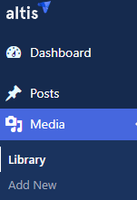
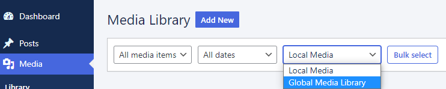
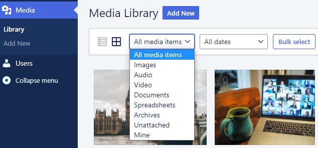
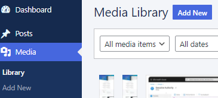
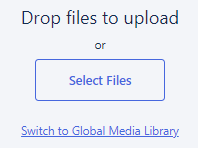
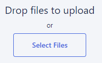

---
title:
order: 0
---

# Global Media Library

Have you got **lots of people** working on **different websites** across your network? The Global Media Library is here to make your life **easier**. It’s a **shared storage library** available in one central place. Where everyone in your organisation can grab the same files for their own projects. 

## How to open the Global Media Library

Click **Media > Library**:

Click the **Local media** dropdown and choose **Global Media Library**:

You can **view** and **filter** (by type or date) files **already uploaded**:

## How to upload to the Global Media Library

Click **Add new** in the **Dashboard** or in the **Media Library**:

Click **Switch to Global Media Library**:

Click **Add New** to upload:

Then either **drag** the file into the blue box, or click **Select Files** and choose the file from the browser dialogue that opens:

