---
title:
order: 0
---

# Images, Videos, and Documents

All of your images, videos and documents are stored and managed in the **Media Library**. Below are some of the common paths to get you there. Plus you can see how to **add**, **insert** and **edit**. ([Editing images](editing-images.md) goes into more detail on this).

## Storing images, videos & documents

You have two ways to store media items:

- **Local Media Library**
    Items stored here are available for the website
- **Global Media Library**
    Items stored here are available for all your websites. [How the Global Media Library works](global-media-library.md)

## How to view the Media Library

Hover over to Media in your dashboard and click **Library**:
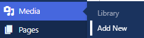

You can now see all media items in one place:
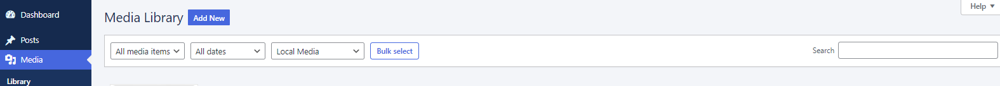

Can’t see the item you’re looking for? Use the **search bar** or click the **dropdown** to filter by:

- **Media type**
  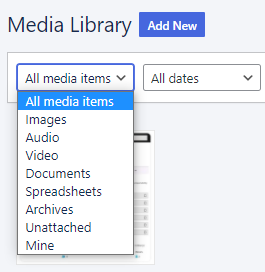
    In case you were wondering, **Archives** means compressed files like ZIP files, Unattached means a file not uploaded from the post or page editor (it does not mean the file is unused), and **Mine** means images you’ve uploaded (useful when lots of people are uploading files)
- **Dates uploaded**
- **Local Media Library** or **Global Media Library**

## How to add images, videos and documents to the Media Library

In your dashboard hover over **Media** and click **Add New**:
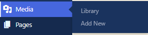

This opens up the **multi-file uploader**. Either drag the files or click Select Files and browse:
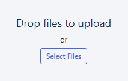

Although maybe you’re ahead of the game and already in the Media Library? Simply click **Add New**:
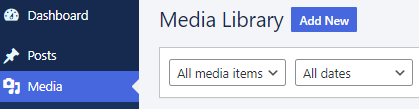

Uploaded images are automatically given **labels**. These are based on what Altis **recognises** in the image. For example, below is an image of code on a screen. From that, the Altis image recognition finds:

- Text
- Menu
- Monitor
- Electronics
- Display
- Screen
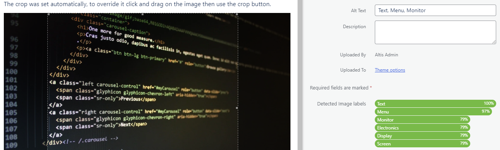

These image recognition labels can be used for searching in the library:
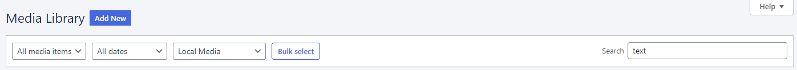

Labels are also used to populate any empty alt text fields. But make sure the alt text describes the image:
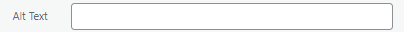

## How to add images, videos and documents to a block

Click to [add a block](../content-and-content-blocks/creating-content-with-blocks.md). Use the **search bar** or click **Browse all** if you don’t see the media type:
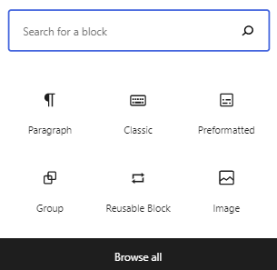

Undecided about which media type to add? Clicking **Browse all** shows you what’s available:
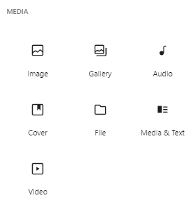

Want to know what each option does? Hover to view a **preview** and explanation:
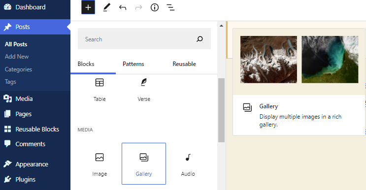

### Types of images, videos and documents

Looking for ways to make your **content stand out** when [creating a block](../content-and-content-blocks/creating-content-with-blocks.md)? The Media Library comes with several customisable options. 
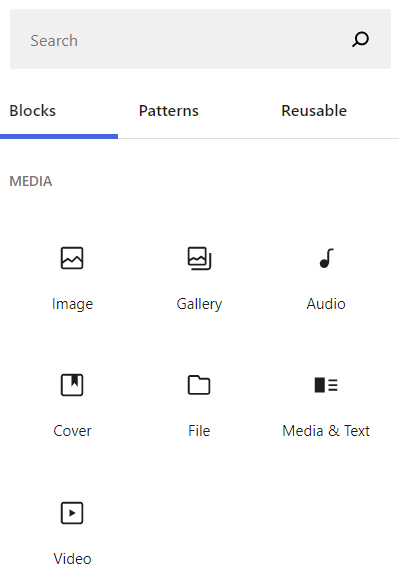

You can use these for images, audio, text, even mix things up with text and media side-by-side.

- **Image**
    Inserts a single image. Include alt text that describes the image, an image title, and description. You can also add a **caption** (use these—they often get read almost as much as headlines)
    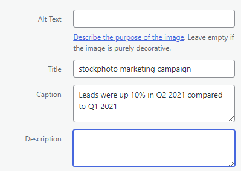
- **Gallery**
    Inserts a **row of images**. They stay aligned and automatically adjust layout on mobile and desktop screens.
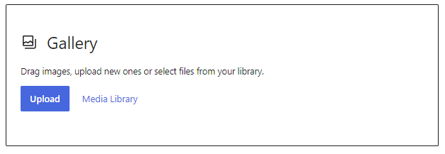
- **Audio**
    Inserts an **audio player** for your audio files. Alongside play/pause, there are also playback speed and download buttons.
    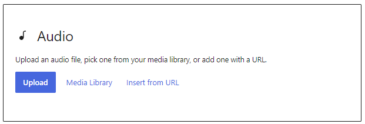
- **Cover**
    Add an image with a text overlay. Great for **headers and banners**. You can also add extra colors—hover over a circle for a brief explanation of what each circle does:
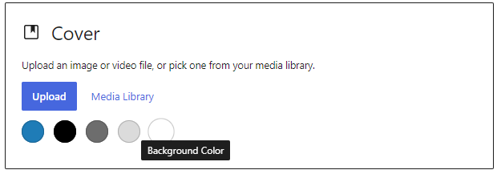
- **File**
    Add a link to a file. A **clickable file name** appears on the page/post next to a **download button**.
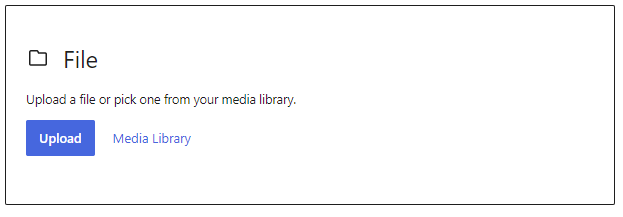
- **Media & text**
    Put a media item on one side and text on the other:
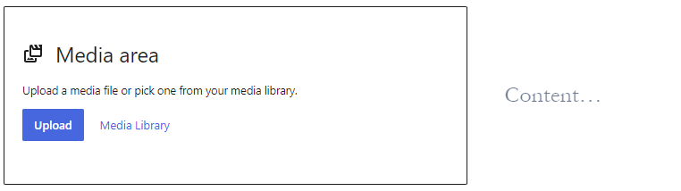
- **Video**
    Upload a video from your Media Library, or insert from URL.
    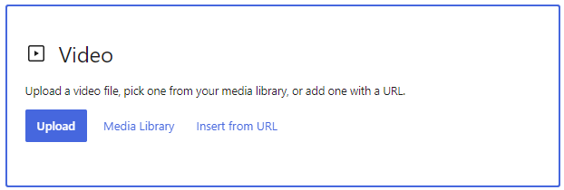

#### Embedding media

There’s another option that doesn’t involve uploading media to your server. After all, some files such as videos use up lots of space. You can choose to embed media. 

When browsing a block, scroll to the **EMBEDs** section and click to add your preferred media:
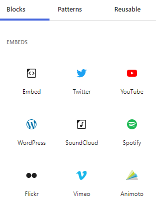

After you **choose** the media type, you can **customise** and [edit](editing-images.md) in the sidebar Block:

#### How to add featured images

Featured images (historically called Post Thumbnails) are images that represent an individual Post, Page, or Custom Post Type. 

Depending on your theme, the featured image can be used in different ways. For example, on your archive page, in your header, or above a post. Featured images can also appear as the default image when shared on social media

Click **Settings > Page**:
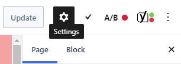

Click the **Featured Image dropdown** and then click **Set featured image**:
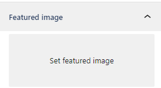

This takes you to the **Media Library** for you to add an image.

## Supported file types

(default **maximum upload file size is 1GB**)

WordPress supports uploading the following file types:

### Images

- .jpg
- .jpeg
- .png
- .gif
- .ico

### Documents

- .pdf (Portable Document Format; Adobe Acrobat)
- .doc, .docx (Microsoft Word Document)
- .ppt, .pptx, .pps, .ppsx (Microsoft PowerPoint Presentation)
- .odt (OpenDocument Text Document)
- .xls, .xlsx (Microsoft Excel Document)
- .psd (Adobe Photoshop Document)

### Audio

- .mp3
- .m4a
- .ogg
- .wav

### Video

- .mp4, .m4v (MPEG-4)
- .mov (QuickTime)
- .wmv (Windows Media Video)
- .avi
- .mpg
- .ogv (Ogg)
- .3gp (3GPP)
- .3g2 (3GPP2)
