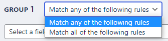
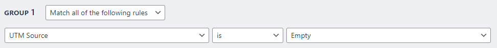

---
title:
order: 30
---

# Audiences

Want to understand more about your website visitors and give them better **experiences**? Audiences is the place to start. It’s a way of **grouping** your visitors, based on criteria you set. 

It only takes a **few clicks** to set up an Audience. Naturally, the more Audiences you set up, the more **granular** you can go with your messaging.

## How to create an Audience

Click Audiences in the dashboard:

Click Add New:

Give your Audience a title. Maybe based on the **Audience type** so you can remember it later. 

For this example, let’s say you run an ecommerce store. You’re running Google PPC ads for your Christmas campaign. You want to create an Audience for people who’ve clicked your ad:

### Audience rules

Let’s add the rules that **define your Audience**. 

First, choose if the rules should apply to **all** or **any**. 

For the Christmas PPC ad we’ll choose **Match all of the following rules**:

### Audience fields

You’ll find plenty of fields for including (and excluding) people from your Audience. The more fields you use, the more **segmented** your Audience becomes.

Click the **Select a field** dropdown:

Help yourself to these options:

**Campaign-related**
- First UTM Campaign
- First UTM Source
- First UTM Medium
- First UTM Term
- First UTM Content
- UTM Campaign
- UTM Source
- UTM Medium
- UTM Term
- UTM Content
- Referrer
- Current referrer (for tracking visitors referred more than once)
- First referrer (for tracking performance of the initial referrer)

**Device-related**
- Browser
- Browser locale
- Browser version
- Operating System
- Operating System version

**Location-related**

- Country

**Behaviour-related**

- Sessions (when your visitor does more than one action in one visit)
- Page views 

**Time-related**

- Hour
- Day
- Month
- Year

### Audience conditions

Now we can include, exclude, and set conditions. Let’s stick with our Google PPC Christmas ad example:

First, we’ll choose **UTM Source** (click the dropdown to view all the other options):

Next, we’ll choose the **condition**:

We’ll add Google as the UTM source, by clicking **Other, please specify**:

That’s the first rule done:

We can also **make this rule even more specific**. Imagine the ecommerce store runs Google PPC ads all year. Let’s keep our Christmas ad Audience separate. 

Click **Add a rule**:

We’ve already defined the Audience as:

- People who clicked the ecommerce store’s Christmas PPC ad

Let’s say the Christmas ad launched in **December**. So we’ll add a rule that this Audience is only people who clicked in December. We exclude people who clicked ads at other times of the year. 

Choose Month as the field, and then add the number 12 (December = 12th month):

The group is ready to go:
 

### Adding multiple audience groups

Want to add more groups? Click the **Add a group** button:

With **two or more groups**, you can also click the dropdown to match **all or any** groups:

### Audience size

Altis also shows you how adding different fields and conditions will impact the **Audience size**. Data is based on the previous seven days. So if you’re building a new website, it shows 0 until you start getting visitors:

As you gather more data, Audiences will become more powerful. Just like your website:

### How to activate an Audience

When you’ve finished configuring, click the toggle to activate (or deactivate) and click Publish. 

You can also save the Audience as a **draft**:

You can now use Audiences for:

- [Analytics](insights.md)
    Build up a segmented picture of how different groups act on your website
- [Personalisation](../content-and-content-blocks/experience-blocks.md)
    Create experience blocks with content customised for every audience
