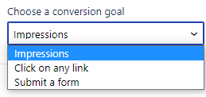

# Experience Blocks

With Experience Blocks, you can **create different versions of your content to show to different audiences**. It’s a way of making
your site give more **personalised** and **contextual** experiences. Instead of standard one-size-fits-all messaging.

For example, you might run an event for CEOs in Spain and the UK. Create an experience block that displays Spanish language to
Spain-based visitors, and displays English to UK-based visitors. For visitors outside of those locations, create a generic
“fallback” block that displays both English and Spanish.

What’s more, you can **measure the performance** of each variation. Run A/B tests, try different versions of content, and discover
more about your website visitors.

## How to add an Experience Block

Click the **+** sign to add a block:

Click **Personalized Content** (you may need to type this into the search bar, or click **Browse all**):

### Creating a Fallback block in Altis

First, create your **Fallback block**. This block will be shown to visitors who don't fit into the audiences you specify. Try using
something **generic** that is still informative:

Click this block and the **sidebar** opens. Give your block a **title**. Here’s also where you can also add another version of the
block–the **variant**:

## How to create a variant experience block

Click **Settings** to show the block sidebar:

Click the Fallback block you’ve created. In the block sidebar, click the **Add a variant** button:

Now it’s time to choose which [audience](../personalising-content/audiences.md) is going to see this variant.

### How to choose an audience for your variant block

In the **block sidebar**, under **Variant 1** click **Select Audience**:

Either scroll down and click on an audience that you’ve already created. Or scroll up and click **Add New**:

Review the audience **groups** and **rules**. Check the audience is **active**.

If you made any changes to the audience, click **Update** then **Select**. Otherwise just click **Select**:

For **each variant you create**, a tab will appear above the block. Click each tab to view the content for each block variant:

### How to copy or delete variants

To **save time**, you can **copy** the chosen variant (a new variant tab automatically appears) :

To **remove a variant**, just click the variant’s tab and then click the **Trash** icon:

## How to create a conversion goal for your Experience Blocks

First, choose how you’re going to measure the performance of your content blocks. Even if a content block performs badly, at least
you know not to use it again. Just like inventor Thomas Edison is supposed to have said, “**I haven’t failed, I’ve just found 10,000
ways that won’t work**.”

Click the block and the variant tab where you want to measure conversions.

In the **block sidebar**, click the **dropdown** under **Choose a conversion goal**:

You’ll see three options:

- **Impressions**
  Choose this when you want to measure how many people **view** the experience block
- **Click on any link**
  Choose this when you want to measure how many people **click** any link or an element that’s hyperlinked (you can also use this
  for clickable buttons or images)
- **Submit a form**
  Choose this when you want to measure how many form **completions** each block gets

When you’ve made your choice, click **Publish**. Altis then **checks** that your Experience Blocks have valid conversion goals and
fallback content:

Altis will now start recording [insights](insights.md) so you can see which variant performs the best.
