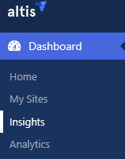
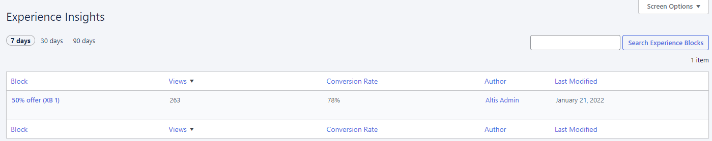
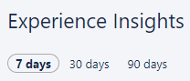
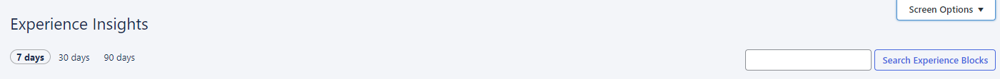
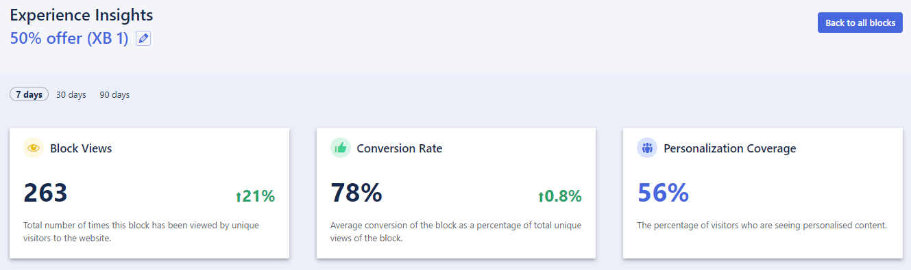
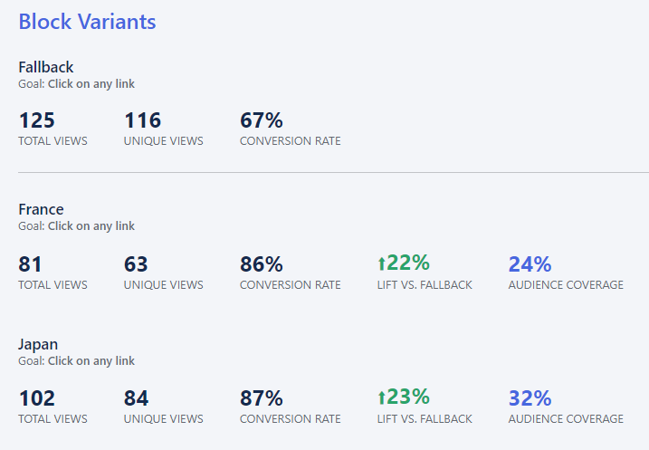

# Insights

Insights is where you see the **conversion results** of your [experience blocks](../content-and-content-blocks/experience-blocks.md). You can either pop in for a quick overview of progress. Or stick around and drill down for more detail. 

## How to view Insights

Insights is waiting for you under the **Dashboard** (click Dashboard if Insights isn’t showing):

This shows a summary of your current Experience blocks. You have **set those up first**, haven’t you? Until that’s done there won’t be much to see here. 

### Viewing a block summary

When you arrive in **Insights** you can see a quick performance summary:

By default this shows:

- Block name
- Number of views
- Conversion rate
- Author
- Date last modified
- First 20 blocks
- Past 7 days of data (click to view 30 or 90 days’ worth)

	

To **change the default view**, click **Screen Options**:

### Viewing deeper block insights

Of course, the summary only gives you, well… a summary of performance. To **dive deeper**, click on a block. You’ll see something like this:

These three blocks show:

- **Block views**
    How many times the block has been viewed by unique visitors
- **Conversion rate**
    Calculated by number of conversions divided by total unique views
- **Personalisation coverage**
    Percentage of visitors who see the personalised blocks

#### Block variants

Scroll down and you’ll see a **performance breakdown** of each block variant. 

The example below shows the performance of a block with variants for:

- French audiences
- Japanese audiences
- Fallback (for audiences that aren’t French or Japanese)

This gives you answers to questions like:

- How many visitors viewed each variant?
- How many unique views did we get?
- How does the conversion rate for a variant compare to the fallback?
- What percentage are coming from our specified audiences?
