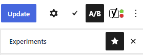
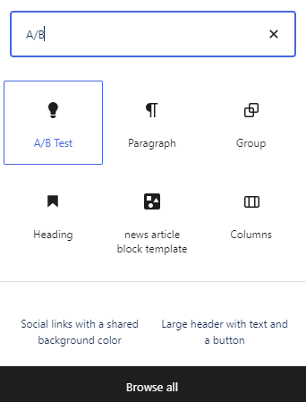
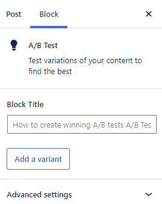
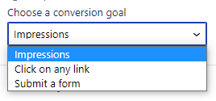
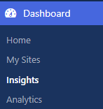

---
title:
order: 0
---

# Multivariant Testing

Multivariant testing allows you to run scheduled A/B tests across content and copy to maximise your audience engagement and continually refine your personalisation strategy.

You can test variations of your pages scientifically. Set dimensions beforehand, so you automatically remove any risks of **bias**. Run tests based on your **hypothesis**. Then wait until Altis notifies you that a test has **won**. 

## How to experiment with A/B tests

Create a page or post.

Click the A/B icon to open the experiments sidebar:

You can test:

- Titles
- Featured images

### How to A/B test titles & images

Click the dropdown next to Titles or images:

You can then add the titles or images you want to test. Both involve the same process. So let’s test a standard “how to” title against something a bit more, well, “marvellous”. 

Title A is the original (or control). It’s generated based on the title already being used:

You can then add the variant as **Title B**. Another box automatically appears if you want to add another variant (**Title C**):

To **remove** a variant, click the **minus icon**.

#### Choose how many visitors to include

The **traffic percentage** shows how many website visitors to include in your test. Imagine you get 1,000 visitors per day.

To include all 1,000 visitors, drag to 100%. To include 500 visitors, drag to 50%. 

When you include less than 100%, the remaining percentage just see the original:

#### How long to run a test

You can set the start and end **dates**. Perhaps for testing seasons (for example winter sales) or promotions (Cyber Monday):

#### How to know when a variant wins

A test wins when it reaches **statistical significance**. That is, when a variant is outperforming the other/s by at least 5%, and there’s a 99% certainty that the results aren’t down to chance.

When this happens, the **Author** and **Admin** get notifications. 

### How to A/B test your content

Setting up different versions is one thing. You can also test different blocks, and give them a conversion goal. You’ll see the results, know what’s working, and discover what needs changing. 

Start [creating your content](../content-and-content-blocks/content-creation.md).

Add an A/B test [block](../content-and-content-blocks/creating-content-with-blocks.md):

Add content to **Variant A** of the block:

Click **Copy** to create **Variant B**:

Use the tab at the top to **switch** between each variant:

When you’re happy with the content for each variant, click the **Settings** icon:

Click **Advanced settings**:

Set the **percentage** of traffic who will view each variant. When you increase the percentage for one variant, you’ll see it decrease for the other variants. 

This can be useful if you already have a variant that’s performing well. So you might want to send the **majority** of your traffic there. And show your variant to a smaller percentage instead:

You can also reduce the percentage of **traffic included** in the test. Reduce this, and the remaining percentage will see the Fallback variant. You can also **pause** the test. 

Each variant can have their own conversion goal:

- **Impressions** (measuring which variant attracts more eyeballs)
- **Click** on any link (useful if you have some calls to action on the page)
- **Submit** a form (when you’re asking for an enquiry, download, or anything involving some sort of transaction)

You can now track the results by checking [Insights](insights.md) in the dashboard:

