---
title:
order: 20
---

# Personalised content

Here’s how to wow your website visitors. Serve up **content that is automatically personalised** based on who they are. **Personalise messaging** for first-time visitors, different regions, people clicking specific ads—it’s up to you. 

You just have to define the [audiences](audiences.md). And then create content for each audience. Then your website will know what to display, to which users, and when. 

## How to add personalised content

Imagine you are running events in:

- Paris, France
- Manchester, UK
- New York, US

You want to show content personalised to those regions. Click to [add a block](../content-and-content-blocks/creating-content-with-blocks.md) and choose **Personalised Content**:
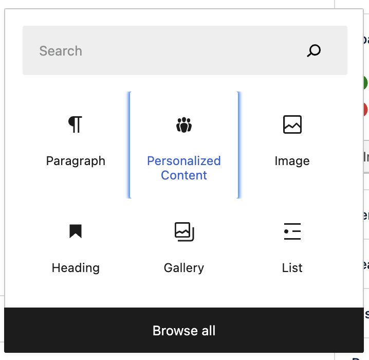

The default block that appears is your **Fallback**. 

This is for content for **audiences who aren’t** from your target regions. So you could put something **generic**, such as referring to “international events”, rather than mentioning specific countries:
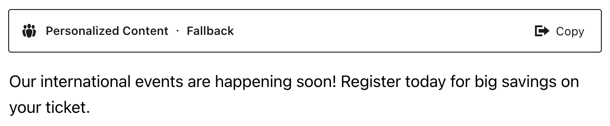

Now it’s time to create **Variant blocks**. These will contain content personalised to your three target regions. 

Click Copy:
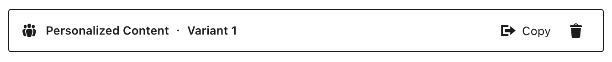

A Variant 1 tab now appears:
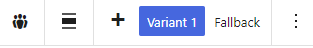

### Choosing the audience 

Let’s say this variant is for [audiences](audiences.md) in Paris, France. 

Click **Select Audience** in the sidebar:
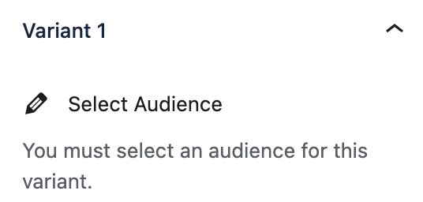

You can now choose the audience. Either click the audience if it already exists. Or click the Add New button and create an audience by following the process explained in the [Audiences article](audiences.md):
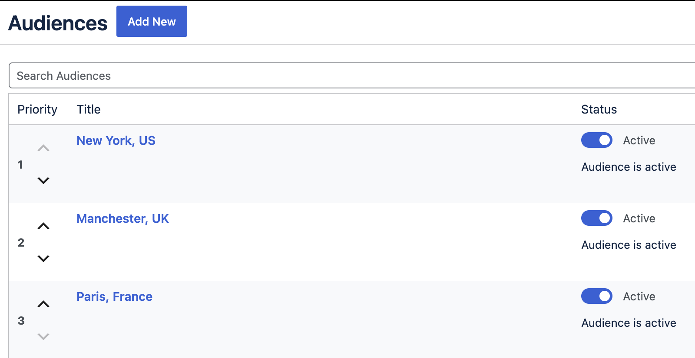

The personalised block now displays the Audience name. Add the content for the France audience:
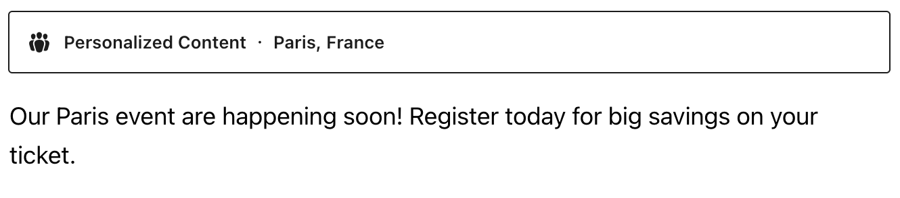

Now copy the Variant again. Repeat the process, this time choosing an audience in the UK. 

Then repeat the process for New York, choosing an audience based in the US.

Prefer to create a **personalised variant from scratch**? Just click the **+** next to **Fallback**:
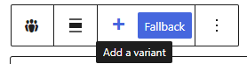

### Choosing a conversion goal

You can also attach a conversion goal to each personalised content variant. You can then track each variant’s performance. The results can be found in [Insights](insights.md). 

After defining your audience, click the **dropdown** under **Choose a conversion goal**:
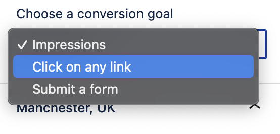

Click to decide how to **measure** the variant’s **performance**:

- **Impressions**
- Click on any **link**
- Submit a **form**

Altis will let you know if the content doesn’t have a link or form:
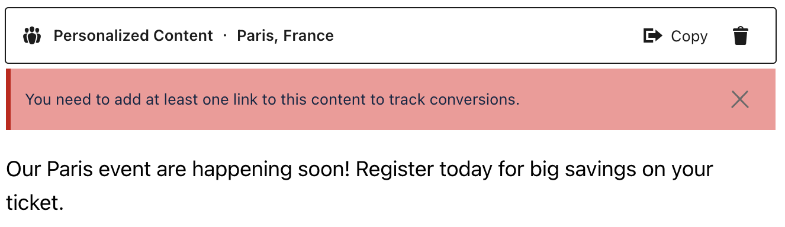

### Previewing personalised content

Depending on your [role and permissions](../collaboration-and-users/roles-and-permissions.md), you can preview the content for each audience. Choose which variant to preview and then click **Preview**:
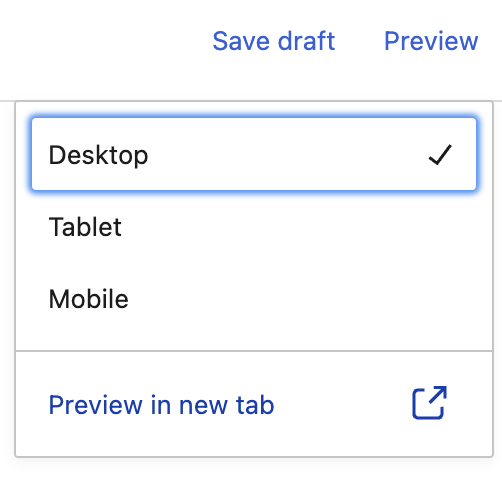

While viewing the preview, hover over **Audience Preview**. You can now click to preview the page for your audiences:
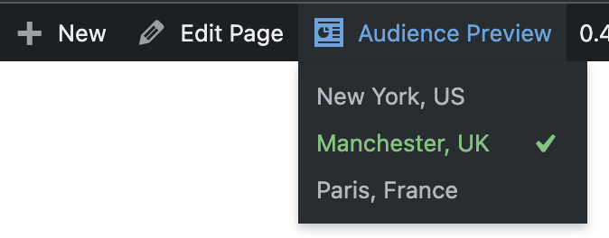

When you’re happy with how everything looks, click **Publish**. Your website is now **automatically** serving up personalised web experiences.
