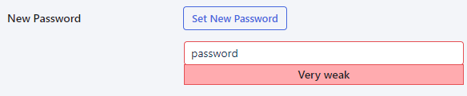
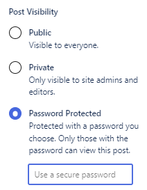

# Security

Altis gives you multiple options for securing your website. From logging in and authentication, to managing passwords and limiting page access. You can set many of these up yourself—without advanced coding or development . 

What’s more, these options are also built to support your auditing and compliance. For example, you get a historical record of changes made inside your website. You can also deactivate users’ accounts while retaining their content. These are tamper-proof and automated, to provide peace of mind and save time.

## How to set user access

You can **limit what users** can do on your website. After all, not everyone needs or wants the responsibility. You just have to decide, “**What level of control does this user need?**” 

### How to manage security for a user

Imagine you’re adding a new user. In your dashboard, click **Users > Add new**:

Click the dropdown to assign their role (what these [roles and permissions](../collaboration-and-users/roles-and-permissions.md) mean):

You can also register **security keys**. These are physical Universal 2nd Factor (U2F)
USB keys. Users plug these into their machines to login, giving you another option to support [Two-Factor Authentication (2FA)](two-factor-authentication.md). 
Scroll down to **Security Keys** and click **Register New Key**:

## Application passwords

Does your website use any **external apps**, **services**, or **APIs**? You can create passwords for these “non-humans” to access what they need. Without giving them access to your actual website. 

Open your **User profile** and scroll down to **Application Passwords**. Add the app name. Then click **Add New Application Password**:

The password now appears. **Save this somewhere**–you can’t retrieve it. The application now appears in your application list, with a **Revoke button** if you need to cancel access:

## Two-factor authentication (2FA)

You’ll have come across 2FA if you use internet banking. Maybe you’ve activated 2FA for your email. It’s where you ask your team to login with two methods, as an extra layer of security. [How to set up two-factor authentication (2FA)](two-factor-authentication.md).

## Password strength

When you add a user, you’ll be asked to include a password. You can use the **automatically generated** password, or click to add your own. Altis will let you know how **strong** (or **weak**) the password is:

## How to hide or limit page/post visibility

These are useful when you’ve created content that **isn’t for public view**. For example, a page that:

- Is only relevant for specific people
- Needs a legal or PR team to check
- Contains private documents for view/download

In the sidebar, click **Public** (next to **Visibility**):

You’ll see the three options. Click the relevant radio button to set the page:

- **Public**
    The page/post is visible to all, and can appear in website lists and search results
- **Private**
    Only logged-in admins and editors can view the page/post. Anyone else trying to access the URL will be redirected to the login screen
- **Password protected**
    After clicking this option, set a password, and click Update:

	Depending on your theme, anyone arriving on the page may see the page title, along with a password prompt.
