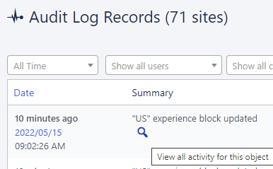
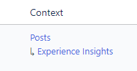
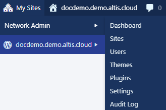
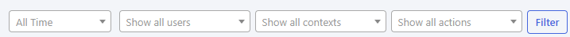
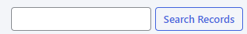
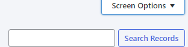
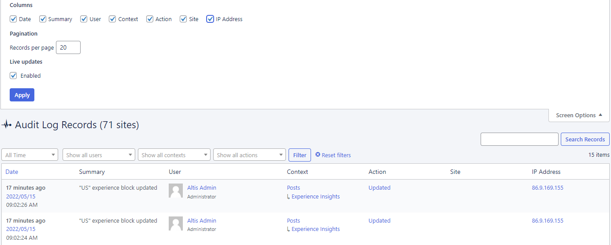
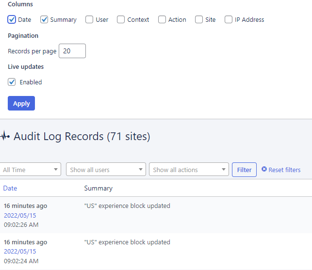

# Audit log

Want to know **who** changed **what** on your website? And **when** and **where**? The Audit Log is that friend who tells you **everything**. 

The Audit Log records every **historical change** (for **auditing** and **compliance**). It can’t be removed or edited.  

## Which does the Audit Log record?

The Audit Log keeps track of everything that happens on your site. Every edit to posts or pages. Every image and file uploaded or deleted. Every update made to settings. The Audit Log gives you full visibility over activity relating to:

- Posts
- Pages
- Custom Post Types
- Users
- Themes
- Plugins
- Tags
- Categories
- Custom Taxonomies
- Settings
- Custom Backgrounds
- Custom Headers
- Menus
- Media Library
- Widgets
- Comments

Records include:

- Date
- Summary (of what happened). Hover over a summary and click the search icon to explore the summary log in more detail:
	 
- User 
- Context (where on your website it happened). This includes showing the location, such as Posts:
	
- Action (what happened)
- Site (on which website)
- IP address (user’s recorded location)

## Who can access the Audit Log

You’ll need to be a **Super Admin** (or any user with Network Admin access) to view the Audit Log. 

## How to access the Audit Log

Slide over to **My Sites > Network Admin > Audit Log**:

## How to filter Audit Log records

As you know, the Audit Log records pretty much **everything**. 

So after logging in, you might be met with a long list of activities. That’s why there are multiple filters to help you find what you need. Click the **dropdowns**, make your **choices**, and click **Filter**:

Or if you know the exact record, enter the details and click **Search Records**:

Of course, there may be times when you have to **scroll** through the records. To save some time, click **Screen Options** (above the search bar):

You can **remove columns**, and increase the **records shown per page** (default is 20):

For example, the screenshot below shows the Audit Log with just the **Date and Summary columns** enabled:

