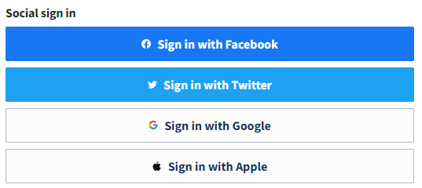

---
title:
order: 20
---

# Single Sign-on (SSO)

Set up SSO and your users can **sign into your websites** via other accounts. For example, let’s say a user has a Microsoft 365 account. You can let them sign in using their Microsoft 365 username and password. That way they don’t have to remember their Altis details. 

What’s more, Microsoft 365 (or whichever external service you choose) still does its **verification** checks. Like when a user logs in from an unknown device or new region. So you get to use the external service’s security as a bonus.

## How to set up SSO

Ask your developer to use the [Altis SSO developer documentation](https://docs.altis-dxp.com/sso/). This includes links to supported authorisation providers [SAML 2.0](https://docs.altis-dxp.com/sso/saml-2-0/) and [WordPress](https://docs.altis-dxp.com/sso/wordpress/).

Your users can then login with their chosen SSO login credentials. The screenshot below shows Hootsuite offering their users SSO:

