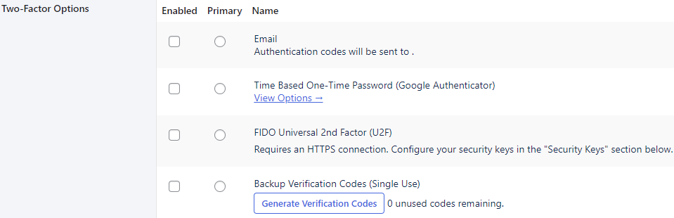
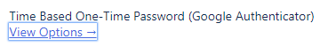
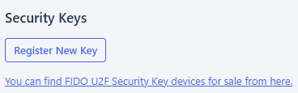
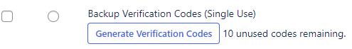
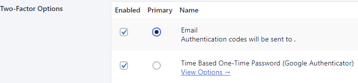
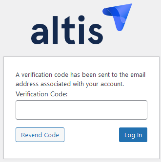

---
title:
order: 0
---

# Two-factor authentication (2FA)

Activating 2FA means your users use two methods (or “factors”) to login. They first enter their username and password. After recognising and authenticating this combination, your website then prompts the user for their second factor. This could be their phone, an email, or a physical security key

Yes, it’s an extra step for logging in. However, it’s also an extra layer of security. After all, a cyber attacker may be able to guess, find or steal a user’s login details. They’re less likely to also have access to a second factor.

## 4 ways to 2FA 

When you [create or edit users](../collaboration-and-users/user-management.md), scroll down to **Two-Factor Options**:

You’ll see four options:

-   **Email**
    This will send a verification code to a user’s email address. They enter this code on your website login page

-   **Time-based One-Time password**
    The user requires an authenticator app that generates two-step verification codes. The app is then linked to their website login credentials. Then, anytime the user tries to login, they have to also open the authenticator app and enter the code that appears. Click **View options** and then scan or enter the **QR code** to link login details with the app:
    
-   **FIDO Universal 2nd Factor**
    Where users have to plug in a **physical security key** to their device. Scroll down to Security Keys and click Register New Key:
    
    It is possible to register multiple keys. This can be a useful backup if one key is lost or stops working. The user just has to enter a name for each key, and plug their key into their device. The key will then be registerd and its name will then be listed.
-   **Backup verification codes**
    This is your backup login plan when other 2FA factors listed above are unavailable. Generate 10 verification codes and save these somewhere safe. Each code can only be used once to login:
    

## How to activate 2FA

Tick the box under the **Enabled** column to choose one or more options. When choosing more than one option, choose which should be the **primary** method:

When you’re finished, scroll down and click **Update User**. The next time you enter your username and password, you’ll be prompted to complete 2FA. 

